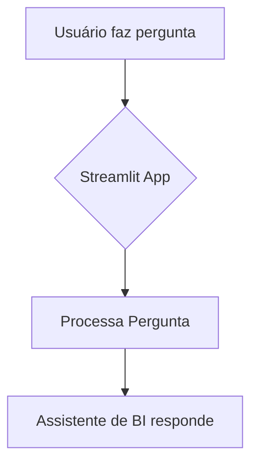
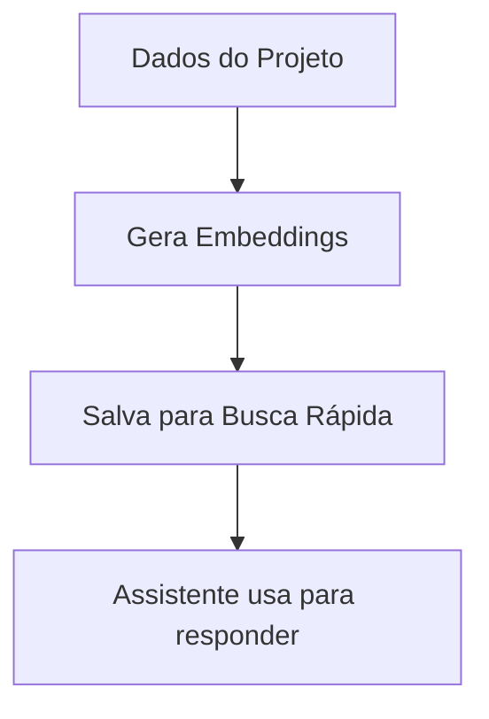
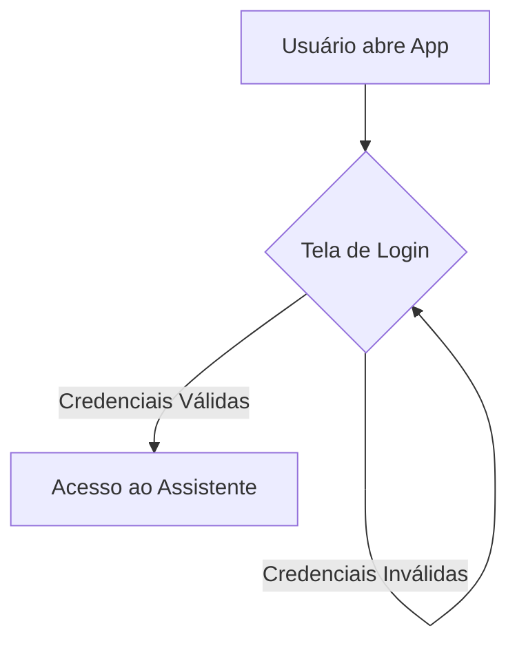

# Agent BI: Assistente de Inteligência de Negócios Conversacional

## Descrição do Projeto

O Agent BI é uma plataforma inovadora que transforma a interação com dados de negócio, permitindo que usuários obtenham insights através de linguagem natural. Construído com Python, Streamlit, FastAPI e integrando LLMs (como OpenAI) com SQL Server e arquivos Parquet, ele oferece uma experiência de BI conversacional completa.

Atualmente, o sistema já conta com um assistente de BI interativo, dashboards personalizáveis, gestão de catálogo de dados para usuários de negócio, e painéis de administração e monitoramento. Nosso foco é aprimorar continuamente a experiência do usuário, a inteligência do agente e a robustez da engenharia.

## Funcionalidades Principais

*   **Assistente de BI Conversacional:** Interface de chat para consultas de dados em linguagem natural.
*   **Dashboard Personalizado:** Fixe e organize gráficos gerados para monitoramento contínuo.
*   **Portal de Gestão de Catálogo:** Permite que usuários de negócio refinem descrições de dados para melhorar a IA.
*   **Painel de Administração:** Gerenciamento de usuários, permissões e monitoramento do sistema.
*   **Monitoramento de Sistema:** Visualização de logs e status de serviços (API, Banco de Dados, LLM).
*   **Pipeline de Dados Automatizado:** Extração e processamento de dados agendados (SQL Server para Parquet).

## Setup

Para configurar e executar o projeto localmente, siga os passos abaixo:

1.  **Clone o repositório:**
    ```bash
    git clone <URL_DO_REPOSITORIO>
    cd Agent_BI
    ```

2.  **Crie e ative o ambiente virtual:**
    ```bash
    python -m venv .venv
    # No Windows
    .venv\Scripts\activate
    # No macOS/Linux
    source .venv/bin/activate
    ```

3.  **Instale as dependências:**
    ```bash
    pip install -r requirements.txt
    ```

4.  **Configure as variáveis de ambiente:**
    Crie um arquivo `.env` na raiz do projeto, baseado no `.env.example`, e preencha com suas credenciais e configurações. Exemplo:
    ```
    OPENAI_API_KEY=sua_chave_aqui
    MSSQL_SERVER=seu_servidor_sql
    MSSQL_DATABASE=seu_banco_de_dados
    MSSQL_USER=seu_usuario
    MSSQL_PASSWORD=sua_senha
    DB_DRIVER={ODBC Driver 17 for SQL Server}
    ```

5.  **Execute a aplicação:**

    *   **Aplicação Principal (Multi-Páginas):**
        ```bash
        streamlit run streamlit_app.py
        ```
        (Apresentação, Dashboard, Monitoramento, etc., estarão disponíveis no menu lateral.)

    *   **Apresentação para Diretoria (Standalone):**
        ```bash
        streamlit run apresentacao_diretoria_standalone.py
        ```
        (Esta é a apresentação focada no projeto e roadmap.)

## Arquitetura do Projeto

O projeto é organizado nas seguintes pastas principais:

*   `core/`: Contém o coração da aplicação, incluindo a lógica de negócio, adaptadores para LLMs e bancos de dados, agentes e a API.
*   `scripts/`: Armazena scripts utilitários para processamento de dados, exportação, limpeza e outras tarefas de automação.
*   `data/`: Contém arquivos de dados, configurações, catálogos e outros recursos estáticos.
*   `pages/`: Contém os arquivos Python que definem as diferentes páginas da aplicação Streamlit.
*   `tools/`: Contém scripts de uso único ou ferramentas auxiliares para diagnóstico e manutenção do projeto.
*   `dags/`: Contém blueprints para orquestração de pipelines de dados, seguindo padrões de ferramentas como Airflow/Mage.

## Visão de Futuro e Roadmap

O Agent BI está em constante evolução para se tornar uma plataforma de inteligência ativa, com foco em três pilares principais:

### Pilar 1: Melhorias na Interface (UI/UX)
*   **Adotar Shadcn-UI:** Implementar uma interface moderna com componentes de alta qualidade.
*   **Chat Avançado:** Incluir avatares e uma caixa de input fixa para melhor usabilidade.
*   **Visualizações Modernas:** Usar cards para exibir gráficos e tabelas estilizadas com cabeçalho fixo.
*   **Acessibilidade:** Garantir Dark Mode e feedback visual claro (toasts, loaders).

### Pilar 2: Evolução da Inteligência (IA)
*   **Implementar LangGraph:** Substituir o agente atual por um supervisor baseado em grafos, permitindo fluxos de decisão mais complexos e robustos.
*   **Respostas Enriquecidas:** Fazer com que a IA não apenas responda, mas também forneça **dicas de negócio automáticas** baseadas nos dados.
*   **Suporte Multi-Usuário Real:** Melhorar a gestão de contexto e histórico de conversas para múltiplos usuários simultâneos.

### Pilar 3: Práticas de Engenharia de Software
*   **Testes Abrangentes:** Implementar uma suíte de testes unitários e de integração para garantir a confiabilidade.
*   **Logging Estruturado:** Melhorar o monitoramento e a depuração com logs mais detalhados.
*   **Escalabilidade Futura:** Planejar a modularização e o uso de containers (Docker) para facilitar a implantação e o crescimento.
*   **CI/CD:** Adotar práticas de Integração e Entrega Contínua para agilizar o desenvolvimento.

## Arquitetura Detalhada e Fluxos

Esta seção descreve os principais fluxos de trabalho do Assistente de BI Caçulinha, com diagramas para facilitar a compreensão.

### 1. Fluxo de Processamento de Consulta

Este fluxograma ilustra como uma pergunta do usuário é processada pelo sistema, desde a entrada no Streamlit até a resposta final.

#### Para Leigos:



#### Para Especialistas:

```mermaid
graph TD
    A[Usuário faz pergunta no Streamlit] --> B(Streamlit App);
    B --> C{QueryProcessor.process_query()};
    C --> D{SupervisorAgent.route_query()};
    D -- "Consulta Simples" --> E(ToolAgent.process_query());
    D -- "Consulta Complexa" --> F(CodeGenAgent.generate_and_execute_code());
    E --> G[Ferramentas SQL/Parquet];
    F --> H[RAG (vector_store.pkl) + LLM];
    G --> I[Resultado da Ferramenta];
    H --> J[Código Python Gerado/Executado];
    I --> K[Resposta para Usuário];
    J --> K;
    K --> B;
```

### 2. Fluxo de Geração de Embeddings (RAG)

Este fluxograma detalha como os embeddings são gerados a partir do catálogo de dados e armazenados para serem usados pelo `CodeGenAgent` no processo de RAG.

#### Para Leigos:



#### Para Especialistas:

```mermaid
graph TD
    A[data/catalog_focused.json] --> B(scripts/generate_embeddings.py);
    B --> C[Carrega Catálogo];
    C --> D[Cria Textos Descritivos de Colunas];
    D --> E[SentenceTransformer.encode()];
    E --> F[Embeddings Gerados];
    F --> G[FAISS.IndexFlatL2.add()];
    G --> H[FAISS Index];
    H --> I[Salva FAISS Index + Metadados];
    I --> J[data/vector_store.pkl];
    J --> K[CodeGenAgent usa para RAG];
```

### 3. Fluxo de Autenticação

Este fluxograma descreve o processo de autenticação de usuários no aplicativo Streamlit.

#### Para Leigos:



#### Para Especialistas:

```mermaid
graph TD
    A[Usuário abre Streamlit App] --> B(auth.login());
    B --> C{Formulário de Login};
    C -- "Submit" --> D{auth_db.autenticar_usuario()};
    D -- "Sucesso" --> E[Sessão Autenticada];
    D -- "Falha" --> C;
    E --> F[Redireciona para Assistente de BI];
    F --> G(show_bi_assistant());
```