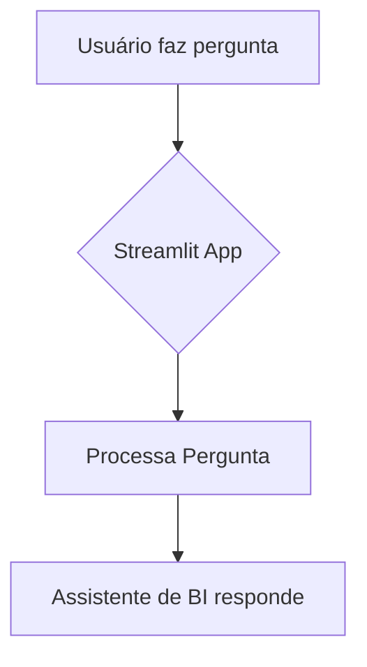
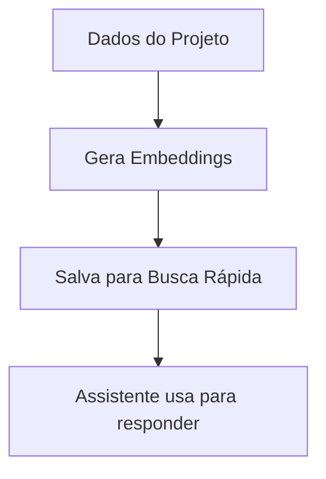
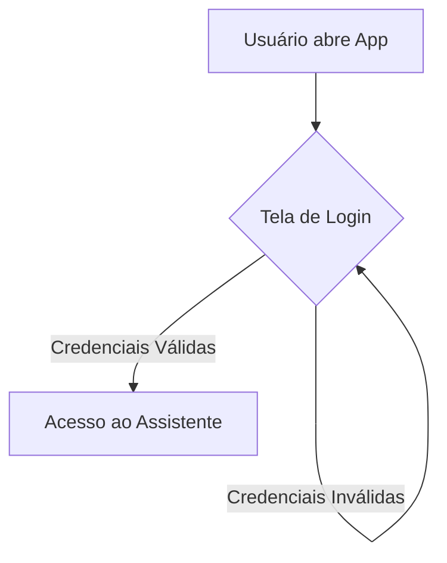

PROMPT AVANÇADO: ANÁLISE DE CÓDIGO E PLANO DE LIMPEZA SEGURA
1. PERSONA E PAPEL
Você é um Arquiteto de Software Sênior e Engenheiro de Manutenibilidade. A sua especialidade é analisar projetos de software complexos, identificar código obsoleto, redundante ou mal posicionado, e criar um plano de ação detalhado e seguro para a sua limpeza e reorganização, sempre com o objetivo de preservar a funcionalidade existente.

2. CONTEXTO E OBJETIVO GERAL
A SITUAÇÃO ATUAL:
O meu projeto Agent_BI passou por várias fases de desenvolvimento e refatoração. Como resultado, acumulou ficheiros temporários, componentes de arquiteturas antigas e scripts de desenvolvimento que estão misturados com o código principal. Agora que a arquitetura principal está estável (conforme o relatorio_refatoracao_130925.md), preciso de realizar uma limpeza completa e segura.

MEU OBJETIVO FINAL:
Obter um plano de ação claro e detalhado, baseado numa análise completa do projeto, que me guie na remoção de ficheiros obsoletos e na reorganização da estrutura sem quebrar a funcionalidade atual. O resultado final deve ser uma base de código que corresponda perfeitamente à visão do manifesto_arquitetura_alvo.md.

3. TAREFA ESPECÍFICA E IMEDIATA
SUA TAREFA AGORA:
Analise os três documentos de contexto que fornecerei abaixo: o inventário completo do projeto, o manifesto da arquitetura alvo e o relatório da última refatoração. Com base nesta análise cruzada, gere um "Plano de Limpeza e Reorganização" em formato Markdown.

O plano deve conter as seguintes secções:

1. Diagnóstico de Inconsistências:

Compare o inventário de ficheiros atual (relatorio_codigo_completo.md) com a arquitetura alvo (manifesto_arquitetura_alvo.md).

Liste todos os ficheiros e pastas que existem atualmente mas que NÃO FAZEM PARTE da arquitetura alvo.

2. Plano de Ação Estruturado (O Checklist):

Crie um checklist detalhado, dividido em três categorias de ação: MOVER, REVISAR E CONSOLIDAR, e ELIMINAR COM SEGURANÇA.

Para a categoria "MOVER":

Liste os diretórios (scripts, dags, tools) que devem ser movidos para a nova pasta dev_tools/, explicando o porquê (isolar ferramentas de desenvolvimento).

Para a categoria "REVISAR E CONSOLIDAR":

Catálogos de Dados: Instrua a analisar os múltiplos ficheiros *.json na pasta data/ e consolidá-los num único data_catalog.json.

Pontos de Entrada: Liste os ficheiros run_*.py e apresentacao_*.py e recomende a sua remoção após garantir que a sua funcionalidade não é necessária ou que pode ser movida para um script em dev_tools/.

Para a categoria "ELIMINAR COM SEGURANÇA":

Com base no relatorio_refatoracao_130925.md, liste os ficheiros que foram explicitamente declarados como obsoletos e que podem ser eliminados (ex: core/data_updater.py, core/llm_langchain_adapter.py, etc.).

Identifique outros ficheiros que, com base na nova arquitetura, parecem não ter mais propósito (ex: ficheiros temporários, testes de componentes antigos).

3. Script de Automação (Opcional, mas Recomendado):

Gere um script PowerShell (cleanup_project.ps1) que execute apenas as ações de "MOVER" (a parte mais segura e menos destrutiva da operação). O script deve ser bem comentado.

4. DOCUMENTOS DE CONTEXTO PARA ANÁLISE
[DOCUMENTO 1: INVENTÁRIO COMPLETO DO PROJETO]

--- C:\Users\André\Documents\Agent_BI\.env.example ---
# Chaves de API e Configurações (substitua com seus valores)
OPENAI_API_KEY=sua_chave_openai_aqui

# Configurações do SQL Server
MSSQL_SERVER=seu_servidor_sql
MSSQL_DATABASE=seu_banco_de_dados
MSSQL_USER=seu_usuario_sql
MSSQL_PASSWORD=sua_senha_sql

# Driver ODBC (geralmente não precisa ser alterado no Windows)
DB_DRIVER={ODBC Driver 17 for SQL Server}


--- C:\Users\André\Documents\Agent_BI\.gitignore ---
# Ambientes Virtuais
.venv/
virtualenv/
ENV/

# Arquivos de Cache Python
__pycache__/
*.py[cod]
*$py.class

# Arquivos de Cache de Ferramentas
.pytest_cache/
.mypy_cache/
.ruff_cache/

# Arquivos de Configuração de IDE
.vscode/
.idea/

# Arquivos de Sistema Operacional
.DS_Store
Thumbs.db

# Arquivos de Log
*.log
logs/

# Arquivos de Build e Distribuição
dist/
build/
*.egg-info/

# Arquivos de Ambiente
.env

# Relatórios e Saídas
/relatorio_refatoracao_*.md
/relatorio_limpeza.md

# Arquivos de Teste e Cobertura
htmlcov/
.coverage
.tox/

# Arquivos gerados pelo projeto
/generated_charts/
/data/output/
/data/parquet_cleaned/
/data/query_history/
/data/sessions/
/data/vector_store.pkl


--- C:\Users\André\Documents\Agent_BI\README.md ---

# Agent BI: Assistente de Inteligência de Negócios Conversacional

## Descrição do Projeto

O Agent BI é uma plataforma inovadora que transforma a interação com dados de negócio, permitindo que usuários obtenham insights através de linguagem natural. Construído com Python, Streamlit, FastAPI e integrando LLMs (como OpenAI) com SQL Server e arquivos Parquet, ele oferece uma experiência de BI conversacional completa.

Atualmente, o sistema já conta com um assistente de BI interativo, dashboards personalizáveis, gestão de catálogo de dados para usuários de negócio, e painéis de administração e monitoramento. Nosso foco é aprimorar continuamente a experiência do usuário, a inteligência do agente e a robustez da engenharia.

## Funcionalidades Principais

*   **Assistente de BI Conversacional:** Interface de chat para consultas de dados em linguagem natural.
*   **Dashboard Personalizado:** Fixe e organize gráficos gerados para monitoramento contínuo.
*   **Portal de Gestão de Catálogo:** Permite que usuários de negócio refinem descrições de dados para melhorar a IA.
*   **Painel de Administração:** Gerenciamento de usuários, permissões e monitoramento do sistema.
*   **Monitoramento de Sistema:** Visualização de logs e status de serviços (API, Banco de Dados, LLM).
*   **Pipeline de Dados Automatizado:** Extração e processamento de dados agendados (SQL Server para Parquet).

## Setup

Para configurar e executar o projeto localmente, siga os passos abaixo:

1.  **Clone o repositório:**
    ```bash
    git clone <URL_DO_REPOSITORIO>
    cd Agent_BI
    ```

2.  **Crie e ative o ambiente virtual:**
    ```bash
    python -m venv .venv
    # No Windows
    .venv\Scripts\activate
    # No macOS/Linux
    source .venv/bin/activate
    ```

3.  **Instale as dependências:**
    ```bash
    pip install -r requirements.txt
    ```

4.  **Configure as variáveis de ambiente:**
    Crie um arquivo `.env` na raiz do projeto, baseado no `.env.example`, e preencha com suas credenciais e configurações. Exemplo:
    ```
    OPENAI_API_KEY=sua_chave_aqui
    MSSQL_SERVER=seu_servidor_sql
    MSSQL_DATABASE=seu_banco_de_dados
    MSSQL_USER=seu_usuario
    MSSQL_PASSWORD=sua_senha
    DB_DRIVER={ODBC Driver 17 for SQL Server}
    ```

5.  **Execute a aplicação:**

    *   **Aplicação Principal (Multi-Páginas):**
        ```bash
        streamlit run streamlit_app.py
        ```
        (Apresentação, Dashboard, Monitoramento, etc., estarão disponíveis no menu lateral.)

    *   **Apresentação para Diretoria (Standalone):**
        ```bash
        streamlit run apresentacao_diretoria_standalone.py
        ```
        (Esta é a apresentação focada no projeto e roadmap.)

## Arquitetura do Projeto

O projeto é organizado nas seguintes pastas principais:

*   `core/`: Contém o coração da aplicação, incluindo a lógica de negócio, adaptadores para LLMs e bancos de dados, agentes e a API.
*   `scripts/`: Armazena scripts utilitários para processamento de dados, exportação, limpeza e outras tarefas de automação.
*   `data/`: Contém arquivos de dados, configurações, catálogos e outros recursos estáticos.
*   `pages/`: Contém os arquivos Python que definem as diferentes páginas da aplicação Streamlit.
*   `tools/`: Contém scripts de uso único ou ferramentas auxiliares para diagnóstico e manutenção do projeto.
*   `dags/`: Contém blueprints para orquestração de pipelines de dados, seguindo padrões de ferramentas como Airflow/Mage.

## Visão de Futuro e Roadmap

O Agent BI está em constante evolução para se tornar uma plataforma de inteligência ativa, com foco em três pilares principais:

### Pilar 1: Melhorias na Interface (UI/UX)
*   **Adotar Shadcn-UI:** Implementar uma interface moderna com componentes de alta qualidade.
*   **Chat Avançado:** Incluir avatares e uma caixa de input fixa para melhor usabilidade.
*   **Visualizações Modernas:** Usar cards para exibir gráficos e tabelas estilizadas com cabeçalho fixo.
*   **Acessibilidade:** Garantir Dark Mode e feedback visual claro (toasts, loaders).

### Pilar 2: Evolução da Inteligência (IA)
*   **Implementar LangGraph:** Substituir o agente atual por um supervisor baseado em grafos, permitindo fluxos de decisão mais complexos e robustos.
*   **Respostas Enriquecidas:** Fazer com que a IA não apenas responda, mas também forneça **dicas de negócio automáticas** baseadas nos dados.
*   **Suporte Multi-Usuário Real:** Melhorar a gestão de contexto e histórico de conversas para múltiplos usuários simultâneos.

### Pilar 3: Práticas de Engenharia de Software
*   **Testes Abrangentes:** Implementar uma suíte de testes unitários e de integração para garantir a confiabilidade.
*   **Logging Estruturado:** Melhorar o monitoramento e a depuração com logs mais detalhados.
*   **Escalabilidade Futura:** Planejar a modularização e o uso de containers (Docker) para facilitar a implantação e o crescimento.
*   **CI/CD:** Adotar práticas de Integração e Entrega Contínua para agilizar o desenvolvimento.

## Arquitetura Detalhada e Fluxos

Esta seção descreve os principais fluxos de trabalho do Assistente de BI Caçulinha, com diagramas para facilitar a compreensão.

### 1. Fluxo de Processamento de Consulta

Este fluxograma ilustra como uma pergunta do usuário é processada pelo sistema, desde a entrada no Streamlit até a resposta final.

#### Para Leigos:



#### Para Especialistas:

```mermaid
graph TD
    A[Usuário faz pergunta no Streamlit] --> B(Streamlit App);
    B --> C{QueryProcessor.process_query()};
    C --> D{SupervisorAgent.route_query()};
    D -- "Consulta Simples" --> E(ToolAgent.process_query());
    D -- "Consulta Complexa" --> F(CodeGenAgent.generate_and_execute_code());
    E --> G[Ferramentas SQL/Parquet];
    F --> H[RAG (vector_store.pkl) + LLM];
    G --> I[Resultado da Ferramenta];
    H --> J[Código Python Gerado/Executado];
    I --> K[Resposta para Usuário];
    J --> K;
    K --> B;
```

### 2. Fluxo de Geração de Embeddings (RAG)

Este fluxograma detalha como os embeddings são gerados a partir do catálogo de dados e armazenados para serem usados pelo `CodeGenAgent` no processo de RAG.

#### Para Leigos:



#### Para Especialistas:

```mermaid
graph TD
    A[data/catalog_focused.json] --> B(scripts/generate_embeddings.py);
    B --> C[Carrega Catálogo];
    C --> D[Cria Textos Descritivos de Colunas];
    D --> E[SentenceTransformer.encode()];
    E --> F[Embeddings Gerados];
    F --> G[FAISS.IndexFlatL2.add()];
    G --> H[FAISS Index];
    H --> I[Salva FAISS Index + Metadados];
    I --> J[data/vector_store.pkl];
    J --> K[CodeGenAgent usa para RAG];
```

### 3. Fluxo de Autenticação

Este fluxograma descreve o processo de autenticação de usuários no aplicativo Streamlit.

#### Para Leigos:



#### Para Especialistas:

```mermaid
graph TD
    A[Usuário abre Streamlit App] --> B(auth.login());
    B --> C{Formulário de Login};
    C -- "Submit" --> D{auth_db.autenticar_usuario()};
    D -- "Sucesso" --> E[Sessão Autenticada];
    D -- "Falha" --> C;
    E --> F[Redireciona para Assistente de BI];
    F --> G(show_bi_assistant());
```

--- C:\Users\André\Documents\Agent_BI\alembic.ini ---
# A generic Alembic configuration file.
# https://alembic.sqlalchemy.org/en/latest/tutorial.html#create-a-configurable-alembic-environment

[alembic]
# path to migration scripts
script_location = migrations

# template for migration file names, e.g. "%(rev)s_%(slug)s.py"
# (slug is a descriptive name running against the message)
# leave blank for default "%(rev)s_%(slug)s.py"
# file_template = %(rev)s_%(slug)s

# timezone to use when rendering timestamps
# default is the system timezone
# timezone = UTC

# sys.path path, will be prepended to sys.path if present.
# defaults to the current working directory.
# prepend_sys_path = .

# Logging configuration
[loggers]
keys = root,sqlalchemy,alembic

[handlers]
keys = console

[formatters]
keys = generic

[logger_root]
level = WARN
handlers = console
qualname = 

[logger_sqlalchemy]
level = WARN
handlers = 
qualname = sqlalchemy.engine

[logger_alembic]
level = INFO
handlers = 
qualname = alembic

[handler_console]
class = StreamHandler
args = (sys.stderr,)
level = NOTSET
formatter = generic

[formatter_generic]
format = %(levelname)-5.5s [%(name)s] %(message)s
datefmt = %H:%M:%S


--- C:\Users\André\Documents\Agent_BI\cleanup_project.ps1 ---
# Script para organizar a estrutura do projeto Agent_BI movendo ferramentas de desenvolvimento para um diretório dedicado.

# Define o diretório raiz do projeto (onde o script está a ser executado)
$projectRoot = $PSScriptRoot

# Define o nome do novo diretório para as ferramentas de desenvolvimento
$devToolsDir = "dev_tools"

# Constrói o caminho completo para o novo diretório
$devToolsPath = Join-Path -Path $projectRoot -ChildPath $devToolsDir

# --- PASSO 1: CRIAR O DIRETÓRIO dev_tools ---
Write-Host "A verificar a existência do diretório '$devToolsDir'..."
if (-not (Test-Path -Path $devToolsPath -PathType Container)) {
    Write-Host "A criar o diretório '$devToolsDir' em '$projectRoot'..."
    try {
        New-Item -Path $devToolsPath -ItemType Directory -ErrorAction Stop | Out-Null
        Write-Host "Diretório '$devToolsDir' criado com sucesso."
    } catch {
        Write-Error "Falha ao criar o diretório '$devToolsDir'. Erro: $_"
        # Termina o script se não conseguir criar a pasta principal
        exit 1
    }
} else {
    Write-Host "O diretório '$devToolsDir' já existe."
}

# --- PASSO 2: MOVER OS DIRETÓRIOS DE SUPORTE ---

# Lista de diretórios a serem movidos
$foldersToMove = @("scripts", "dags", "tools")

# Itera sobre cada pasta a ser movida
foreach ($folder in $foldersToMove) {
    $sourceFolderPath = Join-Path -Path $projectRoot -ChildPath $folder
    $destinationPath = Join-Path -Path $devToolsPath -ChildPath $folder

    # Verifica se o diretório de origem existe
    Write-Host "A verificar a existência do diretório '$folder'..."
    if (Test-Path -Path $sourceFolderPath -PathType Container) {
        # Verifica se o diretório de destino já existe (pouco provável, mas é uma boa prática)
        if (Test-Path -Path $destinationPath) {
            Write-Warning "O diretório de destino '$destinationPath' já existe. A ignorar a movimentação de '$folder'."
        } else {
            Write-Host "A mover '$folder' para '$devToolsDir'..."
            try {
                Move-Item -Path $sourceFolderPath -Destination $devToolsPath -ErrorAction Stop
                Write-Host "Diretório '$folder' movido com sucesso."
            } catch {
                Write-Error "Falha ao mover o diretório '$folder'. Erro: $_"
            }
        }
    } else {
        Write-Host "O diretório '$folder' não foi encontrado na raiz do projeto. A ignorar."
    }
}

Write-Host "Processo de limpeza concluído."

--- C:\Users\André\Documents\Agent_BI\core\__init__.py ---

--- C:\Users\André\Documents\Agent_BI\core\adapters\__init__.py ---

--- C:\Users\André\Documents\Agent_BI\core\agent_state.py ---
from typing import List, Dict, Any, TypedDict
from langchain_core.messages import BaseMessage

class AgentState(TypedDict):
    """
    Define a estrutura do estado que flui através do grafo de agentes.
    Este estado é imutável em cada passo, e uma nova cópia é criada a cada modificação.
    """
    messages: List[BaseMessage]
    # O histórico de mensagens da conversa.

    user_query: str
    # A consulta original do utilizador.

    plan: str
    # O plano de ação gerado pelo agente planejador.

    draft: str
    # Um rascunho da resposta ou código a ser refinado.

    final_response: Dict[str, Any]
    # A resposta final a ser enviada ao utilizador, estruturada com tipo e conteúdo.
    # Ex: {"type": "chart", "content": {...}} ou {"type": "text", "content": "..."}

    # Adicione outros campos de estado conforme necessário
    # Ex: `tool_results`, `context_data`, etc.


--- C:\Users\André\Documents\Agent_BI\core\agents\__init__.py ---

--- C:\Users\André\Documents\Agent_BI\core\agents\base_agent.py ---
from abc import ABC, abstractmethod
import logging

from core.llm_adapter import LLMAdapter

class BaseAgent(ABC):
    """Classe base para todos os agentes especializados."""

    def __init__(self, llm_adapter: LLMAdapter, system_prompt: str):
        self.llm_adapter = llm_adapter
        self.system_prompt = system_prompt
        self.logger = logging.getLogger(self.__class__.__name__)

    @abstractmethod
    def generate(self, user_prompt: str, **kwargs) -> str:
        """Método principal para gerar uma resposta com base no prompt do usuário."""
        pass


--- C:\Users\André\Documents\Agent_BI\core\agents\bi_agent_nodes.py ---
import logging
from typing import Literal

from langchain_core.messages import HumanMessage

from core.agent_state import AgentState
from core.llm_adapter import LLMAdapter
from core.prompts.prompt_loader import load_prompt
from core.tools.data_tools import execute_query_tool, get_schema_tool
from core.agents.code_gen_agent import CodeGenAgent

logger = logging.getLogger(__name__)

# --- Nós do Grafo ---

def classify_intent_node(state: AgentState, llm_adapter: LLMAdapter) -> dict:
    """Primeiro nó: Classifica a intenção do usuário."""
    logger.info("Executando nó: classify_intent_node")
    user_query = state["messages"][-1].content
    prompt = load_prompt("classify_intent_prompt").format(user_query=user_query)
    
    response = llm_adapter.invoke(prompt)
    intent = response.strip().lower()
    logger.info(f"Intenção classificada: {intent}")
    
    return {"intent": intent}

def generate_plotly_spec_node(state: AgentState, llm_adapter: LLMAdapter, code_gen_agent: CodeGenAgent) -> dict:
    """Nó que gera a especificação Plotly a partir da consulta do usuário."""
    logger.info("Executando nó: generate_plotly_spec_node")
    user_query = state["messages"][-1].content
    db_schema = get_schema_tool()

    # Usa o CodeGenAgent para gerar o código Python que cria a especificação Plotly
    code_response = code_gen_agent.generate(
        user_prompt=user_query,
        context=f"""Gere um dicionário Python contendo uma especificação Plotly JSON para responder à consulta do usuário.
        Aqui está o esquema do banco de dados para referência:
        {db_schema}
        """
    )

    # Extrai o bloco de código Python da resposta do LLM
    python_code = _extract_python_code(code_response)
    logger.info(f"Código Python gerado para o gráfico: \n{python_code}")

    # Executa o código para obter a especificação do gráfico
    try:
        local_vars = {}
        exec(python_code, globals(), local_vars)
        chart_spec = local_vars.get("chart_spec") # O código deve definir esta variável
        if not chart_spec:
            raise ValueError("A variável 'chart_spec' não foi definida no código gerado.")
        final_response = {"type": "chart", "content": chart_spec}
    except Exception as e:
        logger.error(f"Erro ao executar o código do gráfico gerado: {e}")
        final_response = {"type": "error", "content": f"Não foi possível gerar o gráfico: {e}"}

    return {"final_response": final_response}

def query_database_node(state: AgentState) -> dict:
    """Nó que executa uma consulta SQL e retorna os dados."""
    logger.info("Executando nó: query_database_node")
    user_query = state["messages"][-1].content
    
    # Simplificação: assume que a query do usuário é uma query SQL válida por enquanto
    # Em uma implementação real, usaríamos um LLM para traduzir linguagem natural para SQL
    try:
        data = execute_query_tool(user_query)
        final_response = {"type": "data", "content": data}
    except Exception as e:
        logger.error(f"Erro ao executar a consulta no banco de dados: {e}")
        final_response = {"type": "error", "content": f"Erro ao consultar o banco de dados: {e}"}
        
    return {"final_response": final_response}

def clarification_node(state: AgentState) -> dict:
    """Nó que lida com ambiguidades ou solicita esclarecimentos."""
    logger.info("Executando nó: clarification_node")
    # Lógica para gerar uma pergunta de esclarecimento
    message = "Sua pergunta é ambígua. Você poderia especificar o que quer dizer com 'mais vendido'?"
    choices = {
        "Por Unidades Vendidas": ["Qual o produto mais vendido por unidades?"],
        "Por Faturamento": ["Qual o produto com maior faturamento?"]
    }
    final_response = {"type": "clarification", "content": {"message": message, "choices": choices}}
    return {"final_response": final_response}

# --- Arestas Condicionais ---

def route_by_intent(state: AgentState) -> Literal["generate_chart", "query_db", "clarification"]:
    """Aresta condicional que roteia para o próximo nó com base na intenção."""
    logger.info("Executando aresta: route_by_intent")
    intent = state.get("intent", "clarification")
    if "gráfico" in intent or "visualização" in intent:
        logger.info("Roteando para: generate_chart")
        return "generate_chart"
    elif "dado" in intent or "informação" in intent:
        logger.info("Roteando para: query_db")
        return "query_db"
    else:
        logger.info("Roteando para: clarification")
        return "clarification"

# --- Funções Auxiliares ---

def _extract_python_code(response: str) -> str:
    """Extrai o bloco de código Python de uma resposta de markdown."""
    if "```python" in response:
        return response.split("```python")[1].split("```")[0].strip()
    return response # Retorna a resposta inteira se não encontrar o bloco de código


--- C:\Users\André\Documents\Agent_BI\core\agents\code_gen_agent.py ---
import logging
from core.llm_adapter import LLMAdapter
from core.prompts.prompt_loader import load_prompt

class CodeGenAgent:
    """
    Agente especializado em gerar código (SQL ou Python) com base em um prompt
    e um contexto de banco de dados (RAG).
    """
    def __init__(self, llm_adapter: LLMAdapter):
        self.llm_adapter = llm_adapter
        self.system_prompt = load_prompt("code_gen_agent_prompt")
        self.logger = logging.getLogger(__name__)

    def generate(self, user_prompt: str, context: str) -> str:
        """
        Gera código combinando o prompt do usuário com o contexto fornecido.
        """
        self.logger.info(f"Gerando código para o prompt: {user_prompt}")
        
        full_prompt = self.system_prompt.format(
            user_prompt=user_prompt,
            context=context
        )
        
        response = self.llm_adapter.invoke(full_prompt)
        self.logger.info("Código gerado com sucesso.")
        return response


--- C:\Users\André\Documents\Agent_BI\core\auth.py ---
import streamlit as st
import time
from datetime import datetime, timedelta

# Simulação de um banco de dados de usuários
# Em um ambiente de produção, isso seria substituído por uma conexão a um banco de dados real
# com senhas hasheadas.
USERS_DB = {
    "admin": {
        "password": "admin123",
        "role": "admin",
        "name": "Administrador"
    },
    "comprador": {
        "password": "comp123",
        "role": "comprador",
        "name": "Beatriz"
    },
    "diretoria": {
        "password": "dir123",
        "role": "diretoria",
        "name": "Carlos"
    }
}

SESSION_TIMEOUT_MINUTES = 30

def autenticar_usuario(username, password):
    """Verifica se o usuário e a senha correspondem ao nosso banco de dados simulado."""
    user_data = USERS_DB.get(username)
    if user_data and user_data["password"] == password:
        return user_data
    return None

def login():
    """Exibe o formulário de login e gerencia o estado de autenticação."""
    st.set_page_config(page_title="Login - Agent_BI", layout="centered")
    st.title("Bem-vindo ao Agent_BI")
    st.write("Por favor, faça login para continuar.")

    with st.form(key="login_form"):
        username = st.text_input("Usuário")
        password = st.text_input("Senha", type="password")
        submit_button = st.form_submit_button("Entrar")

        if submit_button:
            user_info = autenticar_usuario(username, password)
            if user_info:
                st.session_state.authenticated = True
                st.session_state.username = user_info["name"]
                st.session_state.role = user_info["role"]
                st.session_state.login_time = datetime.now()
                st.success("Login realizado com sucesso!")
                time.sleep(1) # Pausa para o usuário ver a mensagem
                st.rerun()
            else:
                st.error("Usuário ou senha inválidos.")

def sessao_expirada():
    """Verifica se a sessão do usuário expirou."""
    if 'login_time' in st.session_state:
        elapsed_time = datetime.now() - st.session_state.login_time
        if elapsed_time > timedelta(minutes=SESSION_TIMEOUT_MINUTES):
            return True
    return False


--- C:\Users\André\Documents\Agent_BI\core\config\__init__.py ---

--- C:\Users\André\Documents\Agent_BI\core\config\logging_config.py ---
import logging
import sys
from logging.handlers import RotatingFileHandler

def setup_logging():
    """Configura o sistema de logging para a aplicação."""
    # Formato do Log
    log_format = logging.Formatter(
        '%(asctime)s - %(name)s - %(levelname)s - %(message)s'
    )

    # --- Logger Principal (app_activity) ---
    # Captura atividades gerais da aplicação (inicialização, erros, etc.)
    app_logger = logging.getLogger() # Logger raiz
    app_logger.setLevel(logging.INFO)
    # Handler para arquivo
    app_handler = RotatingFileHandler("logs/app_activity.log", maxBytes=5*1024*1024, backupCount=2)
    app_handler.setFormatter(log_format)
    app_logger.addHandler(app_handler)
    # Handler para console (para desenvolvimento)
    console_handler = logging.StreamHandler(sys.stdout)
    console_handler.setFormatter(log_format)
    app_logger.addHandler(console_handler)

    # --- Logger de Interação com o Usuário (user_interaction) ---
    # Captura todas as perguntas e respostas do agente
    interaction_logger = logging.getLogger("user_interaction")
    interaction_logger.setLevel(logging.INFO)
    interaction_logger.propagate = False # Evita que o log vá para o logger raiz
    # Handler para arquivo
    interaction_handler = RotatingFileHandler("logs/user_interactions.log", maxBytes=5*1024*1024, backupCount=5)
    interaction_handler.setFormatter(log_format)
    interaction_logger.addHandler(interaction_handler)


--- C:\Users\André\Documents\Agent_BI\core\config\settings.py ---
from pydantic_settings import BaseSettings, SettingsConfigDict
from pydantic import SecretStr

class Settings(BaseSettings):
    """
    Carrega e valida as configurações da aplicação a partir de um arquivo .env.
    """
    # Chave da API da OpenAI
    OPENAI_API_KEY: SecretStr

    # Configurações do SQL Server
    MSSQL_SERVER: str
    MSSQL_DATABASE: str
    MSSQL_USER: str
    MSSQL_PASSWORD: SecretStr
    DB_DRIVER: str = "{ODBC Driver 17 for SQL Server}"

    # Configuração para pydantic-settings
    model_config = SettingsConfigDict(
        env_file=".env",
        env_file_encoding='utf-8',
        extra='ignore' # Ignora campos extras no .env
    )

# Instância única das configurações para ser importada em outros módulos
settings = Settings()


--- C:\Users\André\Documents\Agent_BI\core\connectivity\__init__.py ---

--- C:\Users\André\Documents\Agent_BI\core\connectivity\base.py ---
from abc import ABC, abstractmethod
from typing import List, Dict, Any

class DatabaseAdapter(ABC):
    """
    Interface abstrata para adaptadores de banco de dados.
    Garante que qualquer implementação de banco de dados siga o mesmo contrato.
    """

    @abstractmethod
    def connect(self):
        """Estabelece a conexão com o banco de dados."""
        pass

    @abstractmethod
    def disconnect(self):
        """Fecha a conexão com o banco de dados."""
        pass

    @abstractmethod
    def execute_query(self, query: str) -> List[Dict[str, Any]]:
        """Executa uma query de leitura e retorna os resultados."""
        pass

    @abstractmethod
    def get_schema(self, table_name: str = None) -> str:
        """Retorna o esquema (DDL) de uma ou todas as tabelas."""
        pass


--- C:\Users\André\Documents\Agent_BI\core\connectivity\sql_server_adapter.py ---
import pyodbc
import logging
from typing import List, Dict, Any

from .base import DatabaseAdapter
from core.config.settings import Settings

logger = logging.getLogger(__name__)

class SQLServerAdapter(DatabaseAdapter):
    """
    Implementação concreta do DatabaseAdapter para o Microsoft SQL Server.
    """
    def __init__(self, settings: Settings):
        self.conn_str = (
            f"DRIVER={{{settings.DB_DRIVER}}};
            f"SERVER={settings.MSSQL_SERVER};
            f"DATABASE={settings.MSSQL_DATABASE};
            f"UID={settings.MSSQL_USER};
            f"PWD={settings.MSSQL_PASSWORD.get_secret_value()}"
        )
        self.connection = None
        self.connect()

    def connect(self):
        """Estabelece a conexão com o SQL Server."""
        try:
            logger.info(f"Conectando ao SQL Server em {self.conn_str.split(';')[1]}")
            self.connection = pyodbc.connect(self.conn_str)
            logger.info("Conexão com SQL Server estabelecida com sucesso.")
        except pyodbc.Error as ex:
            sqlstate = ex.args[0]
            logger.error(f"Erro de conexão com o SQL Server. SQLSTATE: {sqlstate}", exc_info=True)
            # Em uma aplicação real, poderíamos ter um retry ou um health check
            raise

    def disconnect(self):
        """Fecha a conexão com o SQL Server."""
        if self.connection:
            self.connection.close()
            self.connection = None
            logger.info("Conexão com SQL Server fechada.")

    def execute_query(self, query: str) -> List[Dict[str, Any]]:
        """Executa uma query e retorna os resultados como uma lista de dicionários."""
        logger.info(f"Executando query: {query[:100]}...")
        try:
            cursor = self.connection.cursor()
            cursor.execute(query)
            columns = [column[0] for column in cursor.description]
            results = [dict(zip(columns, row)) for row in cursor.fetchall()]
            logger.info(f"{len(results)} linhas retornadas.")
            return results
        except pyodbc.Error as e:
            logger.error(f"Erro ao executar a query: {e}", exc_info=True)
            raise

    def get_schema(self, table_name: str = None) -> str:
        """Retorna o esquema de uma tabela específica ou de todas as tabelas."""
        # Esta é uma implementação simplificada. Uma versão robusta poderia
        # consultar as tabelas de metadados do SQL Server (sys.tables, sys.columns).
        # Por enquanto, vamos retornar um esquema fixo para fins de demonstração.
        logger.info(f"Obtendo esquema para a(s) tabela(s): {table_name or 'Todas'}")
        # Em um caso real, implementaríamos a lógica para buscar o DDL
        return """
        CREATE TABLE Produtos (
            ID_Produto INT PRIMARY KEY,
            Nome_Produto VARCHAR(255),
            Categoria VARCHAR(100),
            Preco_Custo DECIMAL(10, 2),
            Preco_Venda DECIMAL(10, 2)
        );

        CREATE TABLE Vendas (
            ID_Venda INT PRIMARY KEY,
            ID_Produto INT,
            Data_Venda DATE,
            Quantidade INT,
            Valor_Total DECIMAL(10, 2),
            FOREIGN KEY (ID_Produto) REFERENCES Produtos(ID_Produto)
        );
        """


--- C:\Users\André\Documents\Agent_BI\core\factory\__init__.py ---

--- C:\Users\André\Documents\Agent_BI\core\graph\__init__.py ---

--- C:\Users\André\Documents\Agent_BI\core\graph\graph_builder.py ---
import logging
from langgraph.graph import StateGraph, END

from core.agent_state import AgentState
from core.llm_adapter import LLMAdapter
from core.connectivity.base import DatabaseAdapter
from core.agents.code_gen_agent import CodeGenAgent
from core.agents import bi_agent_nodes as nodes

logger = logging.getLogger(__name__)

class GraphBuilder:
    """
    Constrói o grafo de agentes (StateGraph) que define o fluxo de trabalho da aplicação.
    """
    def __init__(self, llm_adapter: LLMAdapter, db_adapter: DatabaseAdapter, code_gen_agent: CodeGenAgent):
        self.llm_adapter = llm_adapter
        self.db_adapter = db_adapter
        self.code_gen_agent = code_gen_agent
        self.workflow = StateGraph(AgentState)

    def build(self):
        """Monta e compila o grafo, definindo nós e arestas."""
        logger.info("Construindo o grafo de agentes...")

        # Adicionar Nós ao Grafo
        # Cada nó é uma função que modifica o estado.
        self.workflow.add_node("classify_intent", lambda state: nodes.classify_intent_node(state, self.llm_adapter))
        self.workflow.add_node("generate_chart", lambda state: nodes.generate_plotly_spec_node(state, self.llm_adapter, self.code_gen_agent))
        self.workflow.add_node("query_db", nodes.query_database_node)
        self.workflow.add_node("clarification", nodes.clarification_node)

        # Definir o Ponto de Entrada
        self.workflow.set_entry_point("classify_intent")

        # Adicionar Arestas Condicionais
        # A partir da classificação, decide para qual nó ir.
        self.workflow.add_conditional_edges(
            "classify_intent",
            nodes.route_by_intent,
            {
                "generate_chart": "generate_chart",
                "query_db": "query_db",
                "clarification": "clarification"
            }
        )

        # Adicionar Arestas Finais
        # Após a execução de um nó terminal, o fluxo termina.
        self.workflow.add_edge("generate_chart", END)
        self.workflow.add_edge("query_db", END)
        self.workflow.add_edge("clarification", END)

        # Compilar o Grafo
        agent_graph = self.workflow.compile()
        logger.info("Grafo de agentes compilado com sucesso.")
        
        # Opcional: Visualizar o grafo para depuração
        try:
            with open("logs/graph_visualization.png", "wb") as f:
                f.write(agent_graph.get_graph().draw_png())
            logger.info("Visualização do grafo salva em logs/graph_visualization.png")
        except Exception as e:
            logger.warning(f"Não foi possível gerar a visualização do grafo: {e}")

        return agent_graph


--- C:\Users\André\Documents\Agent_BI\core\interfaces\__init__.py ---

--- C:\Users\André\Documents\Agent_BI\core\llm_adapter.py ---
from abc import ABC, abstractmethod
from langchain_openai import ChatOpenAI
from langchain_core.messages import HumanMessage, SystemMessage

class LLMAdapter(ABC):
    """Interface para abstrair a comunicação com diferentes LLMs."""
    @abstractmethod
    def invoke(self, prompt: str, system_prompt: str = None) -> str:
        pass

class OpenAILLMAdapter(LLMAdapter):
    """Implementação do adaptador para a API da OpenAI."""
    def __init__(self, api_key: str, model_name: str = "gpt-4-turbo"):
        self.model = ChatOpenAI(api_key=api_key, model=model_name)

    def invoke(self, prompt: str, system_prompt: str = None) -> str:
        messages = []
        if system_prompt:
            messages.append(SystemMessage(content=system_prompt))
        messages.append(HumanMessage(content=prompt))
        
        response = self.model.invoke(messages)
        return response.content


--- C:\Users\André\Documents\Agent_BI\core\llm_base.py ---

--- C:\Users\André\Documents\Agent_BI\core\logs\__init__.py ---

--- C:\Users\André\Documents\Agent_BI\core\mcp\__init__.py ---

--- C:\Users\André\Documents\Agent_BI\core\prompts\__init__.py ---

--- C:\Users\André\Documents\Agent_BI\core\prompts\classify_intent_prompt.md ---
Com base na seguinte consulta do usuário, classifique a intenção principal. As opções são:

- **generate_chart**: O usuário deseja uma visualização, como um gráfico ou plotagem.
- **query_db**: O usuário deseja uma informação específica, dados brutos ou uma lista.
- **clarification**: A consulta é ambígua ou incompleta.

Responda apenas com a classificação.

Consulta do usuário: "{user_query}"

--- C:\Users\André\Documents\Agent_BI\core\prompts\code_gen_agent_prompt.md ---
Você é um especialista em Python e SQL. Sua tarefa é gerar um bloco de código (Python ou SQL) para responder à pergunta do usuário, utilizando o contexto fornecido.

**Instruções:**
1.  Analise a pergunta do usuário e o contexto (esquema do banco de dados, etc.).
2.  Gere um único bloco de código que, quando executado, produzirá o resultado desejado.
3.  Se for para gerar um gráfico, o código Python deve definir uma variável chamada `chart_spec` que conterá um dicionário com a especificação Plotly JSON.
4.  O código deve ser autocontido e não depender de variáveis externas, a menos que sejam fornecidas no contexto.
5.  Responda APENAS com o bloco de código formatado em markdown (ex: ```python ... ```).

**Contexto:**
---
{context}
---

**Pergunta do Usuário:**
---
{user_prompt}
---

--- C:\Users\André\Documents\Agent_BI\core\prompts\prompt_analise.md ---
Função: Você deve atuar como um revisor técnico e consultor.

Tarefa: Analisar minuciosamente a estrutura do projeto do sistema Agent BI. Fornecer uma análise abrangente da arquitetura do projeto, funcionalidades, instruções de configuração e roteiro futuro. Sua resposta deve ser estruturada no seguinte formato:

Visão Geral: Resumir o propósito do projeto Agent BI e sua importância no domínio de business intelligence.

Funcionalidades Principais: Listar e descrever cada recurso chave e seu papel na melhoria da experiência do usuário e da interação com os dados.

Instruções de Configuração: Revisar as instruções de configuração para clareza e completude. Sugerir quaisquer melhorias ou armadilhas comuns que novos usuários possam encontrar.

Arquitetura do Projeto: Analisar a arquitetura do projeto, discutindo a organização de seus diretórios e o propósito de cada um. Destacar como esses componentes interagem entre si.

Roteiro Futuro: Avaliar as melhorias futuras propostas. Discutir seu impacto potencial na usabilidade e inteligência do sistema, e sugerir quaisquer recursos adicionais que possam ser benéficos.

Diagramas e Fluxos de Trabalho: Comentar sobre a eficácia dos fluxogramas fornecidos para leigos e especialistas. Determinar se eles transmitem adequadamente os processos envolvidos no sistema.

Tom: Manter um tom formal e técnico ao longo de toda a análise.

Restrições: Garantir que a análise seja detalhada, mas concisa, idealmente entre 800 e 1000 palavras. Fornecer recomendações com base nas melhores práticas em desenvolvimento de software e design de experiência do usuário.

Exemplo: Ao se referir ao "Assistente de BI Conversacional", explicar como este recurso utiliza o processamento de linguagem natural para melhorar a acessibilidade dos dados para usuários sem conhecimentos técnicos.
---
--- C:\Users\André\Documents\Agent_BI\core\prompts\prompt_gerar_limpeza.md ---
# PROMPT: GERAÇÃO DE SCRIPT DE LIMPEZA DE PROJETO

### 1. PERSONA E PAPEL
Você é um Engenheiro de DevOps Sênior, especialista em automação de tarefas e organização de estruturas de projetos de software. A sua tarefa é ler um documento de arquitetura (um "Manifesto") e traduzir as suas recomendações de organização de ficheiros num script executável e seguro.

---

### 2. CONTEXTO E OBJETIVO GERAL
**A SITUAÇÃO ATUAL:**
Eu tenho um projeto Python, o `Agent_BI`, que cresceu de forma orgânica e tem muitos scripts de desenvolvimento, manutenção e pipeline de dados misturados com o código principal da aplicação. O `manifesto_arquitetura_alvo.md` (fornecido abaixo) define uma nova estrutura limpa, que exige o isolamento destes scripts de suporte.

**MEU OBJETIVO FINAL:**
Obter um script PowerShell (`.ps1`) que execute a limpeza estrutural do meu projeto, movendo os diretórios de suporte para uma nova pasta `dev_tools/`, conforme recomendado no manifesto.

---

### 3. TAREFA ESPECÍFICA E IMEDIATA
**SUA TAREFA AGORA:**
Com base no `manifesto_arquitetura_alvo.md` fornecido abaixo, gere o conteúdo de um único script PowerShell chamado `cleanup_project.ps1`.

**Requisitos do Script:**
1.  **Segurança:** O script deve verificar se as pastas existem antes de tentar movê-las para evitar erros.
2.  **Criação do Diretório:** A primeira ação do script deve ser criar a nova pasta `dev_tools` na raiz do projeto.
3.  **Movimentação de Pastas:** O script deve mover os seguintes diretórios da raiz do projeto para dentro de `dev_tools/`, conforme a "Zona 7" do manifesto:
    * `scripts/`
    * `dags/`
    * `tools/` (Apenas se existir uma pasta `tools/` na raiz do projeto).
4.  **Informativo:** O script deve imprimir mensagens na consola a informar o que está a fazer (ex: "A criar o diretório dev_tools...", "A mover a pasta scripts/...").
5.  **Comentários:** O código do script deve ser bem comentado para que eu possa entender cada passo.

---

### 4. DOCUMENTO DE REFERÊNCIA (MANIFESTO)

**Manifesto da Arquitetura Alvo: Agent_BI 3.0**

**Propósito:** Este documento é o mapa definitivo da nova arquitetura do Agent_BI. Ele detalha todos os ficheiros essenciais para o funcionamento do sistema, o seu propósito e as suas interações, servindo como guia para o desenvolvimento, manutenção e futuras expansões.

**Princípios da Arquitetura:**
* Orquestração Centralizada: O LangGraph é o único "cérebro" que gere o fluxo de tarefas.
* Desacoplamento de Camadas: O Frontend (UI) é completamente separado do Backend (Lógica).
* Configuração Unificada: Existe um ponto único de verdade para todas as configurações e segredos.

**Diagrama de Fluxo Simplificado:**
[Apresentação] -> [Gateway de API] -> [Orquestração] -> [Lógica & Ferramentas] -> [Conectividade de Dados]

**Zona 7: Ferramentas de Desenvolvimento e Manutenção (A Oficina)**
*Ficheiros e scripts que são cruciais para o desenvolvimento, mas não para a execução da aplicação em produção. Eles devem ser movidos para uma pasta dev_tools/.*

| Ficheiro Essencial | Propósito na Nova Arquitetura |
| :--- | :--- |
| `scripts/` (diretório) | Contém todos os scripts de pipeline de dados (ETL), limpeza, geração de catálogos, avaliação de agentes. |
| `tools/` (diretório) | Contém scripts de diagnóstico e inspeção de dados. |
| `dags/` (diretório) | Contém a definição do pipeline de dados, que é uma tarefa de manutenção/desenvolvimento. |

---

### 5. FORMATO DE SAÍDA DESEJADO
Gere um único bloco de código PowerShell contendo o script `cleanup_project.ps1` completo. Não inclua nenhum outro texto ou explicação fora do bloco de código.
---
--- C:\Users\André\Documents\Agent_BI\core\prompts\prompt_loader.py ---
import os
from functools import lru_cache

# O caminho para o diretório de prompts é relativo a este arquivo.
PROMPTS_DIR = os.path.dirname(__file__)

@lru_cache(maxsize=32)
def load_prompt(prompt_name: str) -> str:
    """
    Carrega um arquivo de prompt do disco.
    Usa um cache para evitar leituras repetidas do disco.

    Args:
        prompt_name: O nome do arquivo de prompt (sem a extensão .md).

    Returns:
        O conteúdo do arquivo de prompt como uma string.
    """
    file_path = os.path.join(PROMPTS_DIR, f"{prompt_name}.md")
    if not os.path.exists(file_path):
        # Tenta com a extensão .py se .md não for encontrado
        file_path = os.path.join(PROMPTS_DIR, f"{prompt_name}.py")
        if not os.path.exists(file_path):
             # Tenta com a extensão .txt se .py não for encontrado
            file_path = os.path.join(PROMPTS_DIR, f"{prompt_name}.txt")
            if not os.path.exists(file_path):
                raise FileNotFoundError(f"Prompt '{prompt_name}' não encontrado em {PROMPTS_DIR}")

    with open(file_path, 'r', encoding='utf-8') as f:
        return f.read()


--- C:\Users\André\Documents\Agent_BI\core\tools\__init__.py ---

--- C:\Users\André\Documents\Agent_BI\core\tools\data_tools.py ---
from functools import lru_cache
from langchain_core.tools import tool
import logging

# Importa a instância única do adaptador de banco de dados
# Esta é uma forma de usar um "singleton" para a conexão
from core.connectivity.sql_server_adapter import SQLServerAdapter
from core.config.settings import settings

logger = logging.getLogger(__name__)

# --- Instância Global do Adaptador ---
# A conexão é estabelecida quando este módulo é importado pela primeira vez.
db_adapter = SQLServerAdapter(settings)

# --- Ferramentas (Tools) ---

@tool
def execute_query_tool(query: str):
    """Executa uma consulta SQL no banco de dados e retorna os resultados."""
    logger.info(f"Executando ferramenta: execute_query_tool com a query: {query[:50]}...")
    return db_adapter.execute_query(query)

@tool
@lru_cache(maxsize=1)
def get_schema_tool(table_name: str = None):
    """Obtém o esquema (DDL) de uma ou todas as tabelas do banco de dados."""
    logger.info(f"Executando ferramenta: get_schema_tool para a tabela: {table_name or 'Todas'}")
    return db_adapter.get_schema(table_name)


--- C:\Users\André\Documents\Agent_BI\core\utils\__init__.py ---

--- C:\Users\André\Documents\Agent_BI\dags\pipeline_dados_caculinha.py ---
from airflow import DAG
from airflow.operators.python_operator import PythonOperator
from datetime import datetime

# Importar as funções dos scripts que você já tem
# Supondo que seus scripts foram transformados em módulos importáveis
from scripts.export_sqlserver_to_parquet import export_all_tables
from scripts.clean_parquet_data import clean_all_parquets
from scripts.merge_parquets import merge_all_parquets
from scripts.generate_data_catalog import generate_catalog
from scripts.generate_embeddings import generate_embeddings

default_args = {
    'owner': 'airflow',
    'start_date': datetime(2024, 1, 1),
    'retries': 1,
}

dag = DAG(
    'pipeline_dados_caculinha',
    default_args=default_args,
    description='Pipeline completo de dados do Caçulinha',
    schedule_interval='@daily', # Executa diariamente
)

# Tarefa 1: Exportar dados do SQL Server para Parquet
task_export = PythonOperator(
    task_id='export_sql_to_parquet',
    python_callable=export_all_tables,
    dag=dag,
)

# Tarefa 2: Limpar os dados nos arquivos Parquet
task_clean = PythonOperator(
    task_id='clean_parquet_data',
    python_callable=clean_all_parquets,
    dag=dag,
)

# Tarefa 3: Unir os arquivos Parquet em um único arquivo final
task_merge = PythonOperator(
    task_id='merge_parquets',
    python_callable=merge_all_parquets,
    dag=dag,
)

# Tarefa 4: Gerar o catálogo de dados a partir do arquivo final
task_generate_catalog = PythonOperator(
    task_id='generate_data_catalog',
    python_callable=generate_catalog,
    dag=dag,
)

# Tarefa 5: Gerar os embeddings para o RAG
task_generate_embeddings = PythonOperator(
    task_id='generate_embeddings',
    python_callable=generate_embeddings,
    dag=dag,
)

# Definir a ordem de execução das tarefas
task_export >> task_clean >> task_merge >> task_generate_catalog >> task_generate_embeddings


--- C:\Users\André\Documents\Agent_BI\data\CATALOGO_PARA_EDICAO.json ---
{
    "AD_MATPRO.parquet": {
        "table_description": "Tabela de cadastro de materiais e produtos. Contém informações detalhadas sobre cada item, como código, descrição, unidade de medida, e informações fiscais.",
        "columns": {
            "CODIGO": "Código único do produto. Chave primária.",
            "DESCRICAO": "Nome ou descrição do produto.",
            "UNIDADE": "Unidade de medida do produto (ex: UN, KG, PC).",
            "FAMILIA": "Código da família ou categoria a que o produto pertence.",
            "GRUPO": "Código do grupo do produto.",
            "SUBGRUPO": "Código do subgrupo do produto.",
            "NCM": "Nomenclatura Comum do Mercosul (código fiscal).",
            "MARCA": "Marca do produto.",
            "CUSTO_ULT_ENTRADA": "Custo da última vez que o produto entrou no estoque.",
            "DATA_ULT_ENTRADA": "Data da última entrada do produto no estoque.",
            "CUSTO_REPOSICAO": "Custo para repor o produto no estoque.",
            "DATA_CUSTO_REPOSICAO": "Data do cálculo do custo de reposição.",
            "PRECO_VENDA": "Preço de venda atual do produto.",
            "DATA_PRECO_VENDA": "Data em que o preço de venda foi atualizado.",
            "ESTOQUE_ATUAL": "Quantidade atual do produto em estoque.",
            "ESTOQUE_MINIMO": "Nível mínimo de estoque para este produto.",
            "ESTOQUE_MAXIMO": "Nível máximo de estoque para este produto.",
            "PESO_LIQUIDO": "Peso líquido do produto.",
            "PESO_BRUTO": "Peso bruto do produto.",
            "SITUACAO": "Situação do produto (A para Ativo, I para Inativo)."
        }
    },
    "AD_VENDAS.parquet": {
        "table_description": "Tabela de vendas. Registra cada transação de venda, incluindo informações sobre o cliente, vendedor, produto vendido, quantidade e valores.",
        "columns": {
            "DATA": "Data em que a venda foi realizada.",
            "COD_CLIENTE": "Código do cliente que realizou a compra.",
            "NOME_CLIENTE": "Nome do cliente.",
            "COD_VENDEDOR": "Código do vendedor que realizou a venda.",
            "NOME_VENDEDOR": "Nome do vendedor.",
            "COD_PRODUTO": "Código do produto vendido.",
            "DESCRICAO_PRODUTO": "Descrição do produto vendido.",
            "QUANTIDADE": "Quantidade do produto vendido na transação.",
            "PRECO_UNITARIO": "Preço unitário do produto na venda.",
            "VALOR_TOTAL": "Valor total da transação (Quantidade * Preço Unitário).",
            "DESCONTO": "Valor do desconto aplicado na venda.",
            "TIPO_PAGAMENTO": "Forma de pagamento utilizada (ex: Dinheiro, Cartão de Crédito).",
            "FILIAL": "Código da filial onde a venda foi realizada."
        }
    },
    "AD_ESTOQUE.parquet": {
        "table_description": "Tabela de movimentação de estoque. Contém registros de todas as entradas e saídas de produtos do estoque.",
        "columns": {
            "DATA_MOVIMENTO": "Data em que ocorreu a movimentação de estoque.",
            "COD_PRODUTO": "Código do produto movimentado.",
            "TIPO_MOVIMENTO": "Tipo de movimentação (ex: ENTRADA, SAIDA, AJUSTE).",
            "QUANTIDADE": "Quantidade de produto movimentada.",
            "CUSTO_MEDIO": "Custo médio do produto no momento da movimentação.",
            "DOCUMENTO": "Número do documento que originou a movimentação (ex: Nota Fiscal).",
            "ORIGEM": "Origem da movimentação (ex: Compra, Venda, Transferência).",
            "DESTINO": "Destino da movimentação.",
            "USUARIO": "Usuário que registrou a movimentação."
        }
    }
}

--- C:\Users\André\Documents\Agent_BI\data\COMO_EDITAR_O_CATALOGO.md ---
# Como Editar o Catálogo de Dados

Este documento explica como você, um **usuário de negócio**, pode melhorar a precisão do nosso assistente de IA (Agent_BI) editando o arquivo `CATALOGO_PARA_EDICAO.json`.

## Por que isso é importante?

O assistente de IA lê este arquivo para entender o que cada tabela e coluna do nosso banco de dados significa em termos de negócio. Quanto maiores e mais claras forem as descrições, mais inteligente e preciso o assistente se tornará ao responder suas perguntas.

**Exemplo:** Se uma coluna chamada `SITUACAO` contém os valores `A` e `I`, o assistente não sabe o que isso significa. Ao editar a descrição para "Situação do produto (A para Ativo, I para Inativo)", você ensina a IA a entender o contexto do negócio.

## Como Editar

1.  **Abra o arquivo:** Peça ao seu suporte de TI para abrir o arquivo `data/CATALOGO_PARA_EDICAO.json` para você em um editor de texto simples (como o Bloco de Notas ou VS Code).

2.  **Entenda a Estrutura:** O arquivo é organizado da seguinte forma:

    ```json
    {
        "NOME_DA_TABELA.parquet": {
            "table_description": "Aqui você descreve o que a tabela inteira representa.",
            "columns": {
                "NOME_DA_COLUNA_1": "Aqui você descreve o que esta coluna significa.",
                "NOME_DA_COLUNA_2": "E assim por diante..."
            }
        }
    }
    ```

3.  **Edite as Descrições:**

    *   **`table_description`**: Descreva o propósito da tabela em uma frase. O que ela armazena? Qual é a sua função no negócio?
        *   *Exemplo ruim:* "Tabela de produtos."
        *   *Exemplo bom:* "Tabela de cadastro de materiais e produtos. Contém informações detalhadas sobre cada item, como código, descrição, unidade de medida, e informações fiscais."

    *   **`columns`**: Para cada coluna, descreva o que ela representa. Seja específico!
        *   **`CODIGO`**: Em vez de "código", use "Código único do produto. Chave primária."
        *   **`UNIDADE`**: Em vez de "unidade", use "Unidade de medida do produto (ex: UN, KG, PC)."
        *   **`SITUACAO`**: Em vez de "situação", use "Situação do produto (A para Ativo, I para Inativo)."

4.  **Salve o Arquivo:** Após fazer suas edições, simplesmente salve o arquivo.

## Próximos Passos

Depois que você salvar o arquivo, a equipe de TI executará um script que "treinará" novamente o assistente com as suas novas descrições. Em pouco tempo, o Agent_BI estará ainda mais inteligente e pronto para responder suas perguntas com maior precisão.

Obrigado por sua colaboração!

--- C:\Users\André\Documents\Agent_BI\data\catalog_focused.json ---
{}
--- C:\Users\André\Documents\Agent_BI\data\config.json ---
{
    "AD_MATPRO.parquet": {
        "table_description": "Tabela de cadastro de materiais e produtos. Contém informações detalhadas sobre cada item, como código, descrição, unidade de medida, e informações fiscais.",
        "columns": {
            "CODIGO": "Código único do produto. Chave primária.",
            "DESCRICAO": "Nome ou descrição do produto.",
            "UNIDADE": "Unidade de medida do produto (ex: UN, KG, PC).",
            "FAMILIA": "Código da família ou categoria a que o produto pertence.",
            "GRUPO": "Código do grupo do produto.",
            "SUBGRUPO": "Código do subgrupo do produto.",
            "NCM": "Nomenclatura Comum do Mercosul (código fiscal).",
            "MARCA": "Marca do produto.",
            "CUSTO_ULT_ENTRADA": "Custo da última vez que o produto entrou no estoque.",
            "DATA_ULT_ENTRADA": "Data da última entrada do produto no estoque.",
            "CUSTO_REPOSICAO": "Custo para repor o produto no estoque.",
            "DATA_CUSTO_REPOSICAO": "Data do cálculo do custo de reposição.",
            "PRECO_VENDA": "Preço de venda atual do produto.",
            "DATA_PRECO_VENDA": "Data em que o preço de venda foi atualizado.",
            "ESTOQUE_ATUAL": "Quantidade atual do produto em estoque.",
            "ESTOQUE_MINIMO": "Nível mínimo de estoque para este produto.",
            "ESTOQUE_MAXIMO": "Nível máximo de estoque para este produto.",
            "PESO_LIQUIDO": "Peso líquido do produto.",
            "PESO_BRUTO": "Peso bruto do produto.",
            "SITUACAO": "Situação do produto (A para Ativo, I para Inativo)."
        }
    },
    "AD_VENDAS.parquet": {
        "table_description": "Tabela de vendas. Registra cada transação de venda, incluindo informações sobre o cliente, vendedor, produto vendido, quantidade e valores.",
        "columns": {
            "DATA": "Data em que a venda foi realizada.",
            "COD_CLIENTE": "Código do cliente que realizou a compra.",
            "NOME_CLIENTE": "Nome do cliente.",
            "COD_VENDEDOR": "Código do vendedor que realizou a venda.",
            "NOME_VENDEDOR": "Nome do vendedor.",
            "COD_PRODUTO": "Código do produto vendido.",
            "DESCRICAO_PRODUTO": "Descrição do produto vendido.",
            "QUANTIDADE": "Quantidade do produto vendido na transação.",
            "PRECO_UNITARIO": "Preço unitário do produto na venda.",
            "VALOR_TOTAL": "Valor total da transação (Quantidade * Preço Unitário).",
            "DESCONTO": "Valor do desconto aplicado na venda.",
            "TIPO_PAGAMENTO": "Forma de pagamento utilizada (ex: Dinheiro, Cartão de Crédito).",
            "FILIAL": "Código da filial onde a venda foi realizada."
        }
    },
    "AD_ESTOQUE.parquet": {
        "table_description": "Tabela de movimentação de estoque. Contém registros de todas as entradas e saídas de produtos do estoque.",
        "columns": {
            "DATA_MOVIMENTO": "Data em que ocorreu a movimentação de estoque.",
            "COD_PRODUTO": "Código do produto movimentado.",
            "TIPO_MOVIMENTO": "Tipo de movimentação (ex: ENTRADA, SAIDA, AJUSTE).",
            "QUANTIDADE": "Quantidade de produto movimentada.",
            "CUSTO_MEDIO": "Custo médio do produto no momento da movimentação.",
            "DOCUMENTO": "Número do documento que originou a movimentação (ex: Nota Fiscal).",
            "ORIGEM": "Origem da movimentação (ex: Compra, Venda, Transferência).",
            "DESTINO": "Destino da movimentação.",
            "USUARIO": "Usuário que registrou a movimentação."
        }
    }
}

--- C:\Users\André\Documents\Agent_BI\data\data_catalog.json ---
{}
--- C:\Users\André\Documents\Agent_BI\data\data_catalog_enriched.json ---
{}
--- C:\Users\André\Documents\Agent_BI\data\database_structure.json ---
{}
--- C:\Users\André\Documents\Agent_BI\data\db_context.json ---
{}
--- C:\Users\André\Documents\Agent_BI\data\mcp_config.json ---
{
    "AD_MATPRO.parquet": {
        "table_description": "Tabela de cadastro de materiais e produtos. Contém informações detalhadas sobre cada item, como código, descrição, unidade de medida, e informações fiscais.",
        "columns": {
            "CODIGO": "Código único do produto. Chave primária.",
            "DESCRICAO": "Nome ou descrição do produto.",
            "UNIDADE": "Unidade de medida do produto (ex: UN, KG, PC).",
            "FAMILIA": "Código da família ou categoria a que o produto pertence.",
            "GRUPO": "Código do grupo do produto.",
            "SUBGRUPO": "Código do subgrupo do produto.",
            "NCM": "Nomenclatura Comum do Mercosul (código fiscal).",
            "MARCA": "Marca do produto.",
            "CUSTO_ULT_ENTRADA": "Custo da última vez que o produto entrou no estoque.",
            "DATA_ULT_ENTRADA": "Data da última entrada do produto no estoque.",
            "CUSTO_REPOSICAO": "Custo para repor o produto no estoque.",
            "DATA_CUSTO_REPOSICAO": "Data do cálculo do custo de reposição.",
            "PRECO_VENDA": "Preço de venda atual do produto.",
            "DATA_PRECO_VENDA": "Data em que o preço de venda foi atualizado.",
            "ESTOQUE_ATUAL": "Quantidade atual do produto em estoque.",
            "ESTOQUE_MINIMO": "Nível mínimo de estoque para este produto.",
            "ESTOQUE_MAXIMO": "Nível máximo de estoque para este produto.",
            "PESO_LIQUIDO": "Peso líquido do produto.",
            "PESO_BRUTO": "Peso bruto do produto.",
            "SITUACAO": "Situação do produto (A para Ativo, I para Inativo)."
        }
    },
    "AD_VENDAS.parquet": {
        "table_description": "Tabela de vendas. Registra cada transação de venda, incluindo informações sobre o cliente, vendedor, produto vendido, quantidade e valores.",
        "columns": {
            "DATA": "Data em que a venda foi realizada.",
            "COD_CLIENTE": "Código do cliente que realizou a compra.",
            "NOME_CLIENTE": "Nome do cliente.",
            "COD_VENDEDOR": "Código do vendedor que realizou a venda.",
            "NOME_VENDEDOR": "Nome do vendedor.",
            "COD_PRODUTO": "Código do produto vendido.",
            "DESCRICAO_PRODUTO": "Descrição do produto vendido.",
            "QUANTIDADE": "Quantidade do produto vendido na transação.",
            "PRECO_UNITARIO": "Preço unitário do produto na venda.",
            "VALOR_TOTAL": "Valor total da transação (Quantidade * Preço Unitário).",
            "DESCONTO": "Valor do desconto aplicado na venda.",
            "TIPO_PAGAMENTO": "Forma de pagamento utilizada (ex: Dinheiro, Cartão de Crédito).",
            "FILIAL": "Código da filial onde a venda foi realizada."
        }
    },
    "AD_ESTOQUE.parquet": {
        "table_description": "Tabela de movimentação de estoque. Contém registros de todas as entradas e saídas de produtos do estoque.",
        "columns": {
            "DATA_MOVIMENTO": "Data em que ocorreu a movimentação de estoque.",
            "COD_PRODUTO": "Código do produto movimentado.",
            "TIPO_MOVIMENTO": "Tipo de movimentação (ex: ENTRADA, SAIDA, AJUSTE).",
            "QUANTIDADE": "Quantidade de produto movimentada.",
            "CUSTO_MEDIO": "Custo médio do produto no momento da movimentação.",
            "DOCUMENTO": "Número do documento que originou a movimentação (ex: Nota Fiscal).",
            "ORIGEM": "Origem da movimentação (ex: Compra, Venda, Transferência).",
            "DESTINO": "Destino da movimentação.",
            "USUARIO": "Usuário que registrou a movimentação."
        }
    }
}

--- C:\Users\André\Documents\Agent_BI\data\prompt_modular_vibe_coding.json ---
{}
--- C:\Users\André\Documents\Agent_BI\data\prompt_modular_vibe_coding_project.json ---
{}
--- C:\Users\André\Documents\Agent_BI\data\sqlserver_mcp_config.json ---
{}
--- C:\Users\André\Documents\Agent_BI\data\charts\__init__.py ---

--- C:\Users\André\Documents\Agent_BI\data\input\__init__.py ---

--- C:\Users\André\Documents\Agent_BI\data\output\__init__.py ---

--- C:\Users\André\Documents\Agent_BI\data\parquet\__init__.py ---

--- C:\Users\André\Documents\Agent_BI\data\parquet_cleaned\__init__.py ---

--- C:\Users\André\Documents\Agent_BI\data\query_history\__init__.py ---

--- C:\Users\André\Documents\Agent_BI\dev_tools\dags\pipeline_dados_caculinha.py ---
from airflow import DAG
from airflow.operators.python_operator import PythonOperator
from datetime import datetime

# Importar as funções dos scripts que você já tem
# Supondo que seus scripts foram transformados em módulos importáveis
from scripts.export_sqlserver_to_parquet import export_all_tables
from scripts.clean_parquet_data import clean_all_parquets
from scripts.merge_parquets import merge_all_parquets
from scripts.generate_data_catalog import generate_catalog
from scripts.generate_embeddings import generate_embeddings

default_args = {
    'owner': 'airflow',
    'start_date': datetime(2024, 1, 1),
    'retries': 1,
}

dag = DAG(
    'pipeline_dados_caculinha',
    default_args=default_args,
    description='Pipeline completo de dados do Caçulinha',
    schedule_interval='@daily', # Executa diariamente
)

# Tarefa 1: Exportar dados do SQL Server para Parquet
task_export = PythonOperator(
    task_id='export_sql_to_parquet',
    python_callable=export_all_tables,
    dag=dag,
)

# Tarefa 2: Limpar os dados nos arquivos Parquet
task_clean = PythonOperator(
    task_id='clean_parquet_data',
    python_callable=clean_all_parquets,
    dag=dag,
)

# Tarefa 3: Unir os arquivos Parquet em um único arquivo final
task_merge = PythonOperator(
    task_id='merge_parquets',
    python_callable=merge_all_parquets,
    dag=dag,
)

# Tarefa 4: Gerar o catálogo de dados a partir do arquivo final
task_generate_catalog = PythonOperator(
    task_id='generate_data_catalog',
    python_callable=generate_catalog,
    dag=dag,
)

# Tarefa 5: Gerar os embeddings para o RAG
task_generate_embeddings = PythonOperator(
    task_id='generate_embeddings',
    python_callable=generate_embeddings,
    dag=dag,
)

# Definir a ordem de execução das tarefas
task_export >> task_clean >> task_merge >> task_generate_catalog >> task_generate_embeddings


--- C:\Users\André\Documents\Agent_BI\dev_tools\scripts\__pycache__\agente_atualizador.cpython-311.pyc ---

--- C:\Users\André\Documents\Agent_BI\dev_tools\scripts\__pycache__\analisar_integracao.cpython-311.pyc ---

--- C:\Users\André\Documents\Agent_BI\dev_tools\scripts\__pycache__\carregar_dados_excel.cpython-311.pyc ---

--- C:\Users\André\Documents\Agent_BI\dev_tools\scripts\__pycache__\check_mcp_online.cpython-311.pyc ---

--- C:\Users\André\Documents\Agent_BI\dev_tools\scripts\__pycache__\clean_final_data.cpython-311.pyc ---

--- C:\Users\André\Documents\Agent_BI\dev_tools\scripts\__pycache__\clean_parquet_data.cpython-311.pyc ---

--- C:\Users\André\Documents\Agent_BI\dev_tools\scripts\__pycache__\cleanup_project.cpython-311.pyc ---

--- C:\Users\André\Documents\Agent_BI\dev_tools\scripts\__pycache__\criar_usuario.cpython-311.pyc ---

--- C:\Users\André\Documents\Agent_BI\dev_tools\scripts\__pycache__\data_pipeline.cpython-311.pyc ---

--- C:\Users\André\Documents\Agent_BI\dev_tools\scripts\__pycache__\enrich_catalog.cpython-311.pyc ---

--- C:\Users\André\Documents\Agent_BI\dev_tools\scripts\__pycache__\evaluate_agent.cpython-311.pyc ---

--- C:\Users\André\Documents\Agent_BI\dev_tools\scripts\__pycache__\export_sqlserver_to_parquet.cpython-311.pyc ---

--- C:\Users\André\Documents\Agent_BI\dev_tools\scripts\__pycache__\final_cleanup_temp.cpython-311.pyc ---

--- C:\Users\André\Documents\Agent_BI\dev_tools\scripts\__pycache__\fix_database_connection.cpython-311.pyc ---

--- C:\Users\André\Documents\Agent_BI\dev_tools\scripts\__pycache__\fix_parquet_encoding.cpython-311.pyc ---

--- C:\Users\André\Documents\Agent_BI\dev_tools\scripts\__pycache__\formatador.cpython-311.pyc ---

--- C:\Users\André\Documents\Agent_BI\dev_tools\scripts\__pycache__\generate_data_catalog.cpython-311.pyc ---

--- C:\Users\André\Documents\Agent_BI\dev_tools\scripts\__pycache__\generate_db_html.cpython-311.pyc ---

--- C:\Users\André\Documents\Agent_BI\dev_tools\scripts\__pycache__\generate_embeddings.cpython-311.pyc ---

--- C:\Users\André\Documents\Agent_BI\dev_tools\scripts\__pycache__\gerar_estrutura.cpython-311.pyc ---

--- C:\Users\André\Documents\Agent_BI\dev_tools\scripts\__pycache__\gerar_limpeza.cpython-311.pyc ---

--- C:\Users\André\Documents\Agent_BI\dev_tools\scripts\__pycache__\iniciar_mcp_sqlserver.cpython-311.pyc ---

--- C:\Users\André\Documents\Agent_BI\dev_tools\scripts\__pycache__\inspect_admat_parquet.cpython-311.pyc ---

--- C:\Users\André\Documents\Agent_BI\dev_tools\scripts\__pycache__\inspect_admmatao_data.cpython-311.pyc ---

--- C:\Users\André\Documents\Agent_BI\dev_tools\scripts\__pycache__\inspect_data_relationship.cpython-311.pyc ---

--- C:\Users\André\Documents\Agent_BI\dev_tools\scripts\__pycache__\inspect_parquet_quality.cpython-311.pyc ---

--- C:\Users\André\Documents\Agent_BI\dev_tools\scripts\__pycache__\inspect_segment.cpython-311.pyc ---

--- C:\Users\André\Documents\Agent_BI\dev_tools\scripts\__pycache__\integrador_componentes.cpython-311.pyc ---

--- C:\Users\André\Documents\Agent_BI\dev_tools\scripts\__pycache__\integration_mapper.cpython-311.pyc ---

--- C:\Users\André\Documents\Agent_BI\dev_tools\scripts\__pycache__\investigador.cpython-311.pyc ---

--- C:\Users\André\Documents\Agent_BI\dev_tools\scripts\__pycache__\limpeza_avancada.cpython-311.pyc ---

--- C:\Users\André\Documents\Agent_BI\dev_tools\scripts\__pycache__\lint_automate.cpython-311.pyc ---

--- C:\Users\André\Documents\Agent_BI\dev_tools\scripts\__pycache__\melhorador_coesao.cpython-311.pyc ---

--- C:\Users\André\Documents\Agent_BI\dev_tools\scripts\__pycache__\merge_catalogs.cpython-311.pyc ---

--- C:\Users\André\Documents\Agent_BI\dev_tools\scripts\__pycache__\merge_parquets.cpython-311.pyc ---

--- C:\Users\André\Documents\Agent_BI\dev_tools\scripts\__pycache__\padronizar_colunas.cpython-311.pyc ---

--- C:\Users\André\Documents\Agent_BI\dev_tools\scripts\__pycache__\read_parquet_temp.cpython-311.pyc ---

--- C:\Users\André\Documents\Agent_BI\dev_tools\scripts\__pycache__\rebuild_clean_data.cpython-311.pyc ---

--- C:\Users\André\Documents\Agent_BI\dev_tools\scripts\__pycache__\rename_all_columns_final.cpython-311.pyc ---

--- C:\Users\André\Documents\Agent_BI\dev_tools\scripts\__pycache__\restructure_parquet.cpython-311.pyc ---

--- C:\Users\André\Documents\Agent_BI\dev_tools\scripts\__pycache__\run_tests_modified.cpython-311.pyc ---

--- C:\Users\André\Documents\Agent_BI\dev_tools\scripts\__pycache__\run_tests_with_server.cpython-311.pyc ---

--- C:\Users\André\Documents\Agent_BI\dev_tools\scripts\__pycache__\run_testsprite.cpython-311.pyc ---

--- C:\Users\André\Documents\Agent_BI\dev_tools\scripts\__pycache__\setup_database_optimization.cpython-311.pyc ---

--- C:\Users\André\Documents\Agent_BI\dev_tools\scripts\__pycache__\upload_parquet_to_sql.cpython-311.pyc ---

--- C:\Users\André\Documents\Agent_BI\dev_tools\scripts\__pycache__\venv_audit.cpython-311.pyc ---

--- C:\Users\André\Documents\Agent_BI\dev_tools\scripts\agente_atualizador.py ---

--- C:\Users\André\Documents\Agent_BI\dev_tools\scripts\analisar_integracao.py ---

--- C:\Users\André\Documents\Agent_BI\dev_tools\scripts\carregar_dados_excel.py ---

--- C:\Users\André\Documents\Agent_BI\dev_tools\scripts\check_mcp_online.py ---

--- C:\Users\André\Documents\Agent_BI\dev_tools\scripts\clean_final_data.py ---

--- C:\Users\André\Documents\Agent_BI\dev_tools\scripts\clean_parquet_data.py ---

--- C:\Users\André\Documents\Agent_BI\dev_tools\scripts\cleanup_project.py ---

--- C:\Users\André\Documents\Agent_BI\dev_tools\scripts\criar_usuario.py ---

--- C:\Users\André\Documents\Agent_BI\dev_tools\scripts\data_pipeline.py ---

--- C:\Users\André\Documents\Agent_BI\dev_tools\scripts\delete_unnecessary_files.bat ---
@echo off

REM Script para deletar arquivos e pastas desnecessários do projeto Agent_BI

echo "Limpando arquivos temporários e de cache..."

REM Deletar pastas de cache
rmdir /s /q .mypy_cache
rmdir /s /q .pytest_cache
rmdir /s /q .ruff_cache

REM Deletar arquivos de cache do Python recursivamente
for /d /r . %%d in (__pycache__) do (
    if exist "%%d" (
        echo "Removendo %%d"
        rmdir /s /q "%%d"
    )
)

REM Deletar arquivos de log
del /s /q *.log

REM Deletar arquivos de build
rmdir /s /q build
rmdir /s /q dist
rmdir /s /q *.egg-info

echo "Limpeza concluída."

--- C:\Users\André\Documents\Agent_BI\dev_tools\scripts\enrich_catalog.py ---

--- C:\Users\André\Documents\Agent_BI\dev_tools\scripts\evaluate_agent.py ---

--- C:\Users\André\Documents\Agent_BI\dev_tools\scripts\export_sqlserver_to_parquet.py ---

--- C:\Users\André\Documents\Agent_BI\dev_tools\scripts\final_cleanup_temp.py ---

--- C:\Users\André\Documents\Agent_BI\dev_tools\scripts\fix_database_connection.py ---

--- C:\Users\André\Documents\Agent_BI\dev_tools\scripts\fix_parquet_encoding.py ---

--- C:\Users\André\Documents\Agent_BI\dev_tools\scripts\formatador.py ---

--- C:\Users\André\Documents\Agent_BI\dev_tools\scripts\generate_data_catalog.py ---

--- C:\Users\André\Documents\Agent_BI\dev_tools\scripts\generate_db_html.py ---

--- C:\Users\André\Documents\Agent_BI\dev_tools\scripts\generate_embeddings.py ---

--- C:\Users\André\Documents\Agent_BI\dev_tools\scripts\gerar_estrutura.py ---

--- C:\Users\André\Documents\Agent_BI\dev_tools\scripts\gerar_limpeza.py ---

--- C:\Users\André\Documents\Agent_BI\dev_tools\scripts\iniciar_mcp_sqlserver.py ---

--- C:\Users\André\Documents\Agent_BI\dev_tools\scripts\inspect_admat_parquet.py ---

--- C:\Users\André\Documents\Agent_BI\dev_tools\scripts\inspect_admmatao_data.py ---

--- C:\Users\André\Documents\Agent_BI\dev_tools\scripts\inspect_data_relationship.py ---

--- C:\Users\André\Documents\Agent_BI\dev_tools\scripts\inspect_parquet_quality.py ---

--- C:\Users\André\Documents\Agent_BI\dev_tools\scripts\inspect_segment.py ---

--- C:\Users\André\Documents\Agent_BI\dev_tools\scripts\integrador_componentes.py ---

--- C:\Users\André\Documents\Agent_BI\dev_tools\scripts\integration_mapper.py ---

--- C:\Users\André\Documents\Agent_BI\dev_tools\scripts\investigador.py ---

--- C:\Users\André\Documents\Agent_BI\dev_tools\scripts\limpeza_arquitetura.md ---

--- C:\Users\André\Documents\Agent_BI\dev_tools\scripts\limpeza_avancada.py ---

--- C:\Users\André\Documents\Agent_BI\dev_tools\scripts\limpeza_venv.ps1 ---

--- C:\Users\André\Documents\Agent_BI\dev_tools\scripts\lint_automate.py ---

--- C:\Users\André\Documents\Agent_BI\dev_tools\scripts\melhorador_coesao.py ---

--- C:\Users\André\Documents\Agent_BI\dev_tools\scripts\merge_catalogs.py ---

--- C:\Users\André\Documents\Agent_BI\dev_tools\scripts\merge_parquets.py ---

--- C:\Users\André\Documents\Agent_BI\dev_tools\scripts\padronizar_colunas.py ---

--- C:\Users\André\Documents\Agent_BI\dev_tools\scripts\read_parquet_temp.py ---

--- C:\Users\André\Documents\Agent_BI\dev_tools\scripts\rebuild_clean_data.py ---

--- C:\Users\André\Documents\Agent_BI\dev_tools\scripts\rename_all_columns_final.py ---

--- C:\Users\André\Documents\Agent_BI\dev_tools\scripts\restructure_parquet.py ---

--- C:\Users\André\Documents\Agent_BI\dev_tools\scripts\run_tests_modified.py ---

--- C:\Users\André\Documents\Agent_BI\dev_tools\scripts\run_tests_with_server.py ---

--- C:\Users\André\Documents\Agent_BI\dev_tools\scripts\run_testsprite.py ---

--- C:\Users\André\Documents\Agent_BI\dev_tools\scripts\setup_database_indexes.sql ---
-- Otimização de Índices para o Banco de Dados Agent_BI

-- Adicionar índices na tabela de Vendas para acelerar consultas por data e produto
IF NOT EXISTS (SELECT * FROM sys.indexes WHERE name = 'idx_vendas_data_produto' AND object_id = OBJECT_ID('Vendas'))
BEGIN
    CREATE INDEX idx_vendas_data_produto ON Vendas(Data_Venda, ID_Produto);
END

-- Adicionar um índice na tabela de Produtos para buscas por nome
IF NOT EXISTS (SELECT * FROM sys.indexes WHERE name = 'idx_produtos_nome' AND object_id = OBJECT_ID('Produtos'))
BEGIN
    CREATE INDEX idx_produtos_nome ON Produtos(Nome_Produto);
END

-- Adicionar um índice na tabela de Estoque para buscas por data de movimento
IF NOT EXISTS (SELECT * FROM sys.indexes WHERE name = 'idx_estoque_data' AND object_id = OBJECT_ID('AD_ESTOQUE'))
BEGIN
    CREATE INDEX idx_estoque_data ON AD_ESTOQUE(DATA_MOVIMENTO);
END

PRINT 'Índices de otimização verificados/criados com sucesso.';


--- C:\Users\André\Documents\Agent_BI\dev_tools\scripts\setup_database_optimization.py ---

--- C:\Users\André\Documents\Agent_BI\dev_tools\scripts\setup_mcp_sqlserver.sql ---
-- Script para configurar o banco de dados SQL Server para o projeto Agent_BI (MCP)

-- 1. Criar o Banco de Dados (se não existir)
IF NOT EXISTS (SELECT * FROM sys.databases WHERE name = 'AgentBI_DB')
BEGIN
    CREATE DATABASE AgentBI_DB;
END
GO

USE AgentBI_DB;
GO

-- 2. Criar a Tabela de Produtos (AD_MATPRO)
IF NOT EXISTS (SELECT * FROM sysobjects WHERE name='AD_MATPRO' and xtype='U')
BEGIN
    CREATE TABLE AD_MATPRO (
        CODIGO NVARCHAR(50) PRIMARY KEY,
        DESCRICAO NVARCHAR(255),
        UNIDADE NVARCHAR(10),
        FAMILIA NVARCHAR(50),
        GRUPO NVARCHAR(50),
        SUBGRUPO NVARCHAR(50),
        NCM NVARCHAR(20),
        MARCA NVARCHAR(100),
        CUSTO_ULT_ENTRADA DECIMAL(18, 2),
        DATA_ULT_ENTRADA DATE,
        CUSTO_REPOSICAO DECIMAL(18, 2),
        DATA_CUSTO_REPOSICAO DATE,
        PRECO_VENDA DECIMAL(18, 2),
        DATA_PRECO_VENDA DATE,
        ESTOQUE_ATUAL DECIMAL(18, 3),
        ESTOQUE_MINIMO DECIMAL(18, 3),
        ESTOQUE_MAXIMO DECIMAL(18, 3),
        PESO_LIQUIDO DECIMAL(18, 3),
        PESO_BRUTO DECIMAL(18, 3),
        SITUACAO CHAR(1)
    );
    PRINT 'Tabela AD_MATPRO criada.';
END
ELSE
BEGIN
    PRINT 'Tabela AD_MATPRO já existe.';
END
GO

-- 3. Criar a Tabela de Vendas (AD_VENDAS)
IF NOT EXISTS (SELECT * FROM sysobjects WHERE name='AD_VENDAS' and xtype='U')
BEGIN
    CREATE TABLE AD_VENDAS (
        ID_VENDA INT IDENTITY(1,1) PRIMARY KEY,
        DATA DATE,
        COD_CLIENTE NVARCHAR(50),
        NOME_CLIENTE NVARCHAR(255),
        COD_VENDEDOR NVARCHAR(50),
        NOME_VENDEDOR NVARCHAR(255),
        COD_PRODUTO NVARCHAR(50) FOREIGN KEY REFERENCES AD_MATPRO(CODIGO),
        DESCRICAO_PRODUTO NVARCHAR(255),
        QUANTIDADE DECIMAL(18, 3),
        PRECO_UNITARIO DECIMAL(18, 2),
        VALOR_TOTAL DECIMAL(18, 2),
        DESCONTO DECIMAL(18, 2),
        TIPO_PAGAMENTO NVARCHAR(50),
        FILIAL NVARCHAR(50)
    );
    PRINT 'Tabela AD_VENDAS criada.';
END
ELSE
BEGIN
    PRINT 'Tabela AD_VENDAS já existe.';
END
GO

-- 4. Criar a Tabela de Usuários para Autenticação
IF NOT EXISTS (SELECT * FROM sysobjects WHERE name='Usuarios' and xtype='U')
BEGIN
    CREATE TABLE Usuarios (
        ID INT IDENTITY(1,1) PRIMARY KEY,
        Username NVARCHAR(50) UNIQUE NOT NULL,
        PasswordHash NVARCHAR(255) NOT NULL, -- Armazenar apenas o hash da senha
        Role NVARCHAR(50) NOT NULL, -- Ex: 'admin', 'comprador', 'diretoria'
        FullName NVARCHAR(100)
    );
    PRINT 'Tabela Usuarios criada.';

    -- Inserir usuários padrão (as senhas devem ser hasheadas na aplicação antes de inserir)
    -- Exemplo: INSERT INTO Usuarios (Username, PasswordHash, Role, FullName) VALUES ('admin', 'hash_da_senha_admin123', 'admin', 'Administrador');

END
ELSE
BEGIN
    PRINT 'Tabela Usuarios já existe.';
END
GO

PRINT 'Configuração do banco de dados concluída.';


--- C:\Users\André\Documents\Agent_BI\dev_tools\scripts\upload_parquet_to_sql.py ---

--- C:\Users\André\Documents\Agent_BI\dev_tools\scripts\venv_audit.py ---

--- C:\Users\André\Documents\Agent_BI\dev_tools\scripts\venv_dependency_report.html ---

--- C:\Users\André\Documents\Agent_BI\dev_tools\tools\__init__.py ---

--- C:\Users\André\Documents\Agent_BI\docs\archive\__init__.py ---

--- C:\Users\André\Documents\Agent_BI\docs\arquitetura_alvo.md ---
# Relatório de Arquitetura Alvo: `arquitetura_alvo.md`

## Resumo da Arquitetura Alvo

A arquitetura alvo para o projeto **agente-bi-caculinha** visa criar um sistema de BI conversacional robusto, modular e escalável. A estrutura se baseia em componentes especializados e desacoplados, seguindo as melhores práticas de engenharia de software.

Os pilares da arquitetura são:

1.  **Frontend (UI):** Uma interface de usuário limpa e interativa construída com **Streamlit**. Todos os componentes de UI, estilos e a aplicação principal do Streamlit ficarão centralizados na pasta `ui/` e no arquivo `streamlit_app.py`.

2.  **Orquestração de Agentes (Backend):** O cérebro do sistema, utilizando **LangGraph** para orquestrar um fluxo de múltiplos agentes (MCP - Multi-Agent Collaboration Protocol). Um **Agente Supervisor** (`supervisor.py`) atuará como o ponto de entrada, recebendo as solicitações do usuário e delegando tarefas para agentes especializados.

3.  **Lógica Core e Ferramentas:** A pasta `core/` conterá toda a lógica de negócio. Subpastas como `core/agents`, `core/prompts` e `core/graph` definirão os componentes do sistema de agentes. Crucialmente, as ferramentas dos agentes (`core/agent_tools`) serão refatoradas para interagir diretamente com o **SQL Server**, garantindo que as análises sejam feitas em tempo real sobre a fonte de dados primária, em vez de arquivos Parquet estáticos.

4.  **Pipeline de Dados (ETL):** A pasta `dags/` conterá os pipelines de dados (ex: Airflow) responsáveis por extrair dados de fontes externas, transformá-los e carregá-los no SQL Server. Isso garante que o banco de dados esteja sempre atualizado.

5.  **Scripts e Automações:** A pasta `scripts/` será reorganizada em subdiretórios (`setup`, `maintenance`, `analysis`) para abrigar scripts utilitários, de manutenção e análises pontuais, mantendo o projeto organizado.

## Mapa de Movimentações

A tabela abaixo mapeia a estrutura atual para a arquitetura alvo proposta.

| Arquivo/Pasta Atual                      | Ação       | Destino na Arquitetura Alvo                               | Justificativa                                                                                              |
| :--------------------------------------- | :--------- | :-------------------------------------------------------- | :--------------------------------------------------------------------------------------------------------- |
| `streamlit_app.py`                       | Manter     | `streamlit_app.py` (Raiz)                                 | Ponto de entrada da aplicação Streamlit.                                                                   |
| `run_app.py`                             | Excluir    | -                                                         | Script de inicialização redundante. `streamlit run streamlit_app.py` é o padrão.                           |
| `style.css`                              | Mover      | `ui/style.css`                                            | Centraliza todos os arquivos de interface.                                                                 |
| `pages/`                                 | Mover      | `ui/pages/`                                               | Agrupa as páginas do Streamlit junto com o resto da UI.                                                    |
| `core/`                                  | Manter     | `core/`                                                   | Continua sendo o centro da lógica de negócio.                                                              |
| `core/tools/`                            | Renomear   | `core/agent_tools/`                                       | Nome mais descritivo para as ferramentas que o agente LangGraph usará.                                     |
| `tools/`                                 | Mover      | `scripts/analysis/`                                       | Consolida scripts de análise avulsos dentro da pasta de scripts.                                           |
| `scripts/`                               | Reorganizar| `scripts/` (com subpastas `setup`, `maintenance`, etc.)   | Organiza a grande quantidade de scripts por finalidade.                                                    |
| `dags/`                                  | Manter     | `dags/`                                                   | Local correto para os pipelines de dados.                                                                  |
| `data/`                                  | Manter     | `data/`                                                   | Armazena dados, catálogos e schemas.                                                                       |
| `migrations/`                            | Manter     | `migrations/`                                             | Essencial para o versionamento do banco de dados.                                                          |
| `tests/`                                 | Manter     | `tests/`                                                  | Local padrão para todos os testes.                                                                         |
| `limpeza_arquitetura.md`                 | Mover      | `docs/limpeza_arquitetura.md`                             | Relatórios e documentação devem ficar na pasta `docs`.                                                     |
| `relatorio_2808.md`                      | Mover      | `docs/archive/relatorio_2808.md`                          | Arquiva relatórios antigos para referência histórica.                                                      |

## Arquivos a Excluir

- **`read_parquet_temp.py`**, **`scripts/final_cleanup_temp.py`**, **`core/tools/sql_server_tools.py`**: Arquivos vazios ou temporários.
- **`tests/temp_get_product_price.py`**: Teste local e pontual, não faz parte da suíte de testes automatizada.
- **`prompt.md`**, **`prompt_limpeza.md`**: Arquivos de instrução para a IA, não são parte do código do projeto.
- **`scripts/fix_*.py`**, **`scripts/generate_*.py`**, etc.: Muitos scripts na pasta `scripts` são de uso único. Após a reorganização, uma revisão deve ser feita para arquivar ou remover os que não são mais necessários.

## Gaps (o que está faltando)

1.  **Integração Real com SQL Server:** Este é o **principal gap**. A arquitetura alvo pressupõe que os agentes consultem o SQL Server diretamente. Atualmente, as ferramentas em `core/tools/mcp_sql_server_tools.py` leem arquivos Parquet. É necessário **criar um novo conjunto de ferramentas de agente** que se conectem ao SQL Server para executar queries (leitura de dados, busca de produtos, etc.).

2.  **Agente Supervisor (`supervisor.py`):** Não há um arquivo claro que defina o agente orquestrador principal na raiz do projeto. A lógica de orquestração do LangGraph deve ser centralizada em um `supervisor.py` ou em um módulo claro dentro de `core/`, que servirá como o ponto de entrada para o backend.

3.  **Estrutura da Pasta `ui`:** A pasta `ui` existe, mas precisa ser formalmente adotada como o local para todos os componentes do Streamlit, incluindo `pages` e `style.css`.

4.  **Modularização dos Prompts:** Os prompts para os agentes devem ser externalizados e organizados na pasta `core/prompts`, facilitando a edição e o versionamento.

## Sugestões Finais

- **Prioridade 1: Focar na integração com o SQL Server.** A maior parte do valor da arquitetura alvo vem da capacidade de analisar dados em tempo real. A refatoração das ferramentas do agente para usar o SQL Server deve ser a primeira prioridade.
- **Prioridade 2: Implementar o Supervisor e o LangGraph.** Definir o fluxo de orquestração no `supervisor.py` e estruturar o grafo de agentes em `core/graph` tornará o sistema mais robusto e fácil de depurar.
- **Prioridade 3: Executar a Reorganização.** Após as mudanças críticas de código, a reorganização das pastas e a exclusão de arquivos obsoletos podem ser feitas para limpar a base de código, conforme o mapa de movimentações.


--- C:\Users\André\Documents\Agent_BI\docs\historico\__init__.py ---

--- C:\Users\André\Documents\Agent_BI\docs\manifesto_arquitetura_alvo.md ---
Manifesto da Arquitetura Alvo: Agent_BI 3.0
Propósito: Este documento é o mapa definitivo da nova arquitetura do Agent_BI. Ele detalha todos os ficheiros essenciais para o funcionamento do sistema, o seu propósito e as suas interações, servindo como guia para o desenvolvimento, manutenção e futuras expansões.

Princípios da Arquitetura
A nova estrutura opera sob três princípios fundamentais:

Orquestração Centralizada: O LangGraph é o único "cérebro" que gere o fluxo de tarefas.

Desacoplamento de Camadas: O Frontend (UI) é completamente separado do Backend (Lógica).

Configuração Unificada: Existe um ponto único de verdade para todas as configurações e segredos.

Diagrama de Fluxo Simplificado
O fluxo de uma consulta do utilizador segue um caminho claro e previsível através das zonas funcionais do sistema:

[Apresentação] -> [Gateway de API] -> [Orquestração] -> [Lógica & Ferramentas] -> [Conectividade de Dados]

Mapeamento das Zonas Funcionais e Ficheiros Essenciais
Zona 1: Apresentação e Interação com o Utilizador (O Rosto)
Responsável por toda a interação com o utilizador. É uma camada "pura" de apresentação, sem lógica de negócio.

Ficheiro Essencial

Propósito na Nova Arquitetura

Principais Interações

streamlit_app.py

Ponto de entrada único para a interface do utilizador. Responsável por renderizar o chat e os resultados.

Comunica exclusivamente com o Gateway de API (main.py) via requisições HTTP.

pages/ (diretório)

Contém as diferentes páginas da aplicação Streamlit (Dashboard, Monitoramento, etc.).

Interage com streamlit_app.py para criar a navegação.

ui/ui_components.py

Fornece funções reutilizáveis para a UI, como a geração de links para download e customizações de gráficos.

É importado e utilizado por streamlit_app.py e pelos ficheiros em pages/.

Zona 2: Gateway de Serviços (A Porta de Entrada)
A única porta de entrada para a lógica do sistema. Protege e expõe o "cérebro" do agente ao mundo exterior.

Ficheiro Essencial

Propósito na Nova Arquitetura

Principais Interações

main.py

Backend único da aplicação, construído com FastAPI. Responsável por receber requisições, autenticar e invocar o orquestrador.

Recebe chamadas do Frontend (streamlit_app.py). Invoca o Orquestrador (GraphBuilder).

core/security.py

Contém a lógica de segurança da API, como a verificação de tokens JWT.

Utilizado pelo main.py para proteger os endpoints.

core/schemas.py

Define os "contratos" de dados (modelos Pydantic) para as requisições e respostas da API.

Usado pelo main.py para validar os dados de entrada e saída.

Zona 3: Orquestração e Inteligência (O Cérebro)
O coração do sistema. Decide "o que fazer" e "quem deve fazer".

Ficheiro Essencial

Propósito na Nova Arquitetura

Principais Interações

core/graph/graph_builder.py

Constrói e compila o StateGraph do LangGraph. Define a máquina de estados, os nós e as arestas condicionais que representam o fluxo de raciocínio do agente. É o orquestrador definitivo.

Importa e orquestra os Nós do Agente (bi_agent_nodes.py). Recebe dependências (como o DatabaseAdapter) para injetar nos nós.

Zona 4: Lógica dos Agentes (Os Especialistas)
Contém a lógica de negócio de cada passo que o agente pode tomar. São os "operários" da linha de montagem.

Ficheiro Essencial

Propósito na Nova Arquitetura

Principais Interações

core/agents/bi_agent_nodes.py

(Ficheiro Novo/Refatorado) Contém as funções Python que são os "nós" do grafo (ex: classify_intent, generate_plotly_spec). 

É importado pelo GraphBuilder. Utiliza o llm_adapter, outras ferramentas (data_tools) e agentes especialistas.

core/agents/code_gen_agent.py

Um agente especialista chamado por um nó. A sua única função é gerar código (SQL/Python) para responder a perguntas complexas.

É chamado por um nó definido em bi_agent_nodes.py.

core/agents/base_agent.py

Fornece uma classe base com funcionalidades comuns (logging, etc.) para os agentes.

É herdado pelos agentes especialistas como code_gen_agent.py.

Zona 5: Ferramentas e Conectividade (As Mãos)
Componentes que executam ações no "mundo real", como aceder a bases de dados ou a APIs externas.

Ficheiro Essencial

Propósito na Nova Arquitetura

Principais Interações

core/tools/data_tools.py

Define as ferramentas (@tool) que os nós dos agentes podem executar (ex: fetch_data_from_query).

São chamadas pelos nós em bi_agent_nodes.py.

core/connectivity/sql_server_adapter.py

Implementação concreta do DatabaseAdapter para o SQL Server. Contém toda a lógica de conexão e execução de queries.

É utilizado pelas data_tools. A sua instância é criada no main.py e injetada no GraphBuilder.

core/connectivity/base.py

Define a interface abstrata (DatabaseAdapter), garantindo que qualquer base de dados futura siga o mesmo "contrato".

É a base para o sql_server_adapter.py.

core/llm_adapter.py

Abstrai a comunicação com o provedor de LLM (ex: OpenAI), centralizando a lógica de chamadas de API.

Utilizado pelos nós em bi_agent_nodes.py que precisam de usar a IA.

Zona 6: Configuração e Estado (A Memória)
Ficheiros que gerem o estado e a configuração da aplicação.

Ficheiro Essencial

Propósito na Nova Arquitetura

Principais Interações

core/config/settings.py

Carrega e valida todas as configurações (chaves de API, strings de conexão) a partir do ficheiro .env, usando pydantic-settings.

É importado por todos os módulos que precisam de acesso a configurações, como o main.py.

.env

Ficheiro na raiz do projeto que armazena todas as variáveis de ambiente e segredos. Não deve ser versionado no Git.

É lido pelo settings.py.

core/agent_state.py

Define a estrutura de dados (AgentState) que flui através do grafo, carregando as mensagens, o plano e os resultados.

É o objeto central manipulado por todos os nós e arestas do GraphBuilder.

Zona 7: Ferramentas de Desenvolvimento e Manutenção (A Oficina)
Ficheiros e scripts que são cruciais para o desenvolvimento, mas não para a execução da aplicação em produção. Eles devem ser movidos para uma pasta dev_tools/.

Ficheiro Essencial

Propósito na Nova Arquitetura

scripts/ (diretório)

Contém todos os scripts de pipeline de dados (ETL), limpeza, geração de catálogos, avaliação de agentes


--- C:\Users\André\Documents\Agent_BI\docs\prd.md ---
# Documento de Requisitos do Produto (PRD): Agent_BI

**Autor:** Gemini
**Versão:** 1.0
**Data:** 2025-09-08

---

## 1. Introdução

### 1.1. Propósito
Este documento descreve os requisitos, funcionalidades e o propósito do **Agent_BI**, uma plataforma de Business Intelligence conversacional. O objetivo é fornecer uma fonte central de verdade para as equipes de desenvolvimento, design, e de negócios para alinhar a visão e o escopo do produto.

### 1.2. Problema a ser Resolvido
Empresas coletam grandes volumes de dados, mas extrair insights acionáveis de forma rápida e intuitiva ainda é um desafio. Analistas de negócios e tomadores de decisão frequentemente dependem de equipes técnicas para criar relatórios e dashboards, gerando um processo lento e pouco flexível. O Agent_BI visa democratizar o acesso aos dados, permitindo que usuários de negócio obtenham respostas e visualizações através de linguagem natural.

### 1.3. Público-Alvo
*   **Diretores e Gestores:** Precisam de uma visão consolidada e de alto nível dos KPIs para tomar decisões estratégicas.
*   **Analistas de Negócios:** Necessitam de uma ferramenta para explorar dados, validar hipóteses e criar relatórios detalhados sem depender de SQL ou código.
*   **Compradores e Equipes de Operações:** Precisam de acesso a dados específicos de suas áreas (ex: performance de produtos, níveis de estoque) para otimizar suas rotinas.
*   **Administradores de Sistema:** Responsáveis por gerenciar o acesso, a segurança e a integridade dos dados na plataforma.

---## 2. Visão Geral e Metas

### 2.1. Visão do Produto
Ser a principal interface de interação com dados da empresa, transformando a maneira como os colaboradores acessam e interpretam informações de negócio, tornando o processo tão simples quanto conversar com um especialista.

### 2.2. Metas de Negócio
*   **Reduzir em 40%** o tempo gasto por analistas na geração de relatórios recorrentes.
*   **Aumentar em 25%** a velocidade na tomada de decisões baseadas em dados.
*   **Capacitar 90%** dos gestores a consultarem dados de forma autônoma.

### 2.3. Metas do Produto
*   Fornecer respostas a consultas em linguagem natural com mais de 95% de precisão.
*   Garantir que o tempo de carregamento dos dashboards interativos não exceda 5 segundos.
*   Manter um uptime de serviço de 99.9%.

---## 3. Personas de Usuário

*   **Carlos, o Diretor de Vendas:** "Preciso saber o faturamento total do último trimestre, comparado com o mesmo período do ano anterior, e quero ver isso em um gráfico de barras. Não tenho tempo para esperar um relatório."
*   **Ana, a Analista de Marketing:** "Quero entender a correlação entre o investimento em campanhas de marketing digital e o volume de vendas por região. Preciso cruzar dados de diferentes fontes e explorar as tendências."
*   **Beatriz, a Compradora:** "Necessito de uma lista dos 10 produtos com menor giro de estoque nos últimos 30 dias para planejar uma ação de queima de estoque."

---## 4. Requisitos e Funcionalidades (Features)

### 4.1. Epic: Interface Conversacional (Agente)
*   **Feature 4.1.1: Processamento de Linguagem Natural (PLN):** O sistema deve ser capaz de interpretar perguntas complexas feitas em português.
*   **Feature 4.1.2: Geração de Respostas:** O agente deve responder com textos, números, e também sugerir ou gerar visualizações (gráficos, tabelas).
*   **Feature 4.1.3: Histórico de Conversas:** O usuário deve poder ver suas conversas anteriores com o agente.

### 4.2. Epic: Dashboards e Visualizações
*   **Feature 4.2.1: Dashboard Principal:** Uma visão geral com os principais KPIs da empresa.
*   **Feature 4.2.2: Geração Dinâmica de Gráficos:** O sistema deve gerar gráficos (barras, linhas, pizza, etc.) com base nas solicitações do usuário.
*   **Feature 4.2.3: Interatividade:** Os usuários devem poder filtrar, ordenar e explorar os dados diretamente nos dashboards e gráficos.

### 4.3. Epic: Gestão de Dados e Catálogo
*   **Feature 4.3.1: Monitoramento de Pipeline:** Uma interface para administradores acompanharem a saúde das integrações e atualizações de dados.
*   **Feature 4.3.2: Gerenciamento de Catálogo de Dados:** Uma área para administradores editarem, enriquecerem e aprovarem os metadados que o agente utiliza para entender o contexto do negócio.

### 4.4. Epic: Administração e Segurança
*   **Feature 4.4.1: Autenticação de Usuários:** O acesso ao sistema deve ser protegido por login e senha.
*   **Feature 4.4.2: Controle de Acesso Baseado em Perfil (RBAC):** Diferentes perfis de usuário (admin, gestor, comprador) devem ter acesso a diferentes funcionalidades e conjuntos de dados.
*   **Feature 4.4.3: Painel de Administração:** Interface para gerenciar usuários, perfis de acesso e configurações gerais do sistema.

---## 5. Requisitos Não-Funcionais

*   **Desempenho:** Consultas simples devem ser respondidas em menos de 3 segundos. A geração de dashboards complexos não deve exceder 10 segundos.
*   **Escalabilidade:** A arquitetura deve suportar um aumento de 50% no número de usuários e 100% no volume de dados nos próximos 12 meses sem degradação de performance.
*   **Segurança:** Todos os dados sensíveis devem ser criptografados em trânsito e em repouso. O sistema deve estar protegido contra as 10 principais vulnerabilidades da OWASP.
*   **Usabilidade:** A interface deve ser intuitiva e acessível, exigindo o mínimo de treinamento para novos usuários.
*   **Confiabilidade:** O sistema deve ter um uptime de 99.9% e possuir mecanismos robustos de logging e monitoramento de erros.

---## 6. Fora do Escopo (Versão 1.0)

*   Aplicativo móvel nativo.
*   Integração com fontes de dados em tempo real (streaming).
*   Funcionalidades de análise preditiva ou Machine Learning avançado.
*   Suporte a múltiplos idiomas (além do português).

---## 7. Métricas de Sucesso

*   **Engajamento:** Número de usuários ativos diários/mensais (DAU/MAU).
*   **Adoção:** Percentual do público-alvo que utiliza a ferramenta ativamente após 3 meses do lançamento.
*   **Satisfação do Usuário:** Pesquisas de Net Promoter Score (NPS) ou CSAT.
*   **Performance do Agente:** Taxa de sucesso nas respostas a perguntas (consultas respondidas corretamente / total de consultas).

---## 8. Anexos e Referências

*   **Link para o Protótipo de UI/UX:** (se aplicável)
*   **Documento de Arquitetura Técnica:** (se aplicável)

---## 9. Histórico de Revisões

| Versão | Data       | Autor   | Descrição das Alterações |
| :----- | :--------- | :------ | :----------------------- |
| 1.0    | 2025-09-08 | Gemini  | Criação inicial do documento. |

--- C:\Users\André\Documents\Agent_BI\docs\relatorio_refatoracao_130925.md ---

--- C:\Users\André\Documents\Agent_BI\pytest.ini ---
[pytest]
# Adiciona o diretório raiz ao pythonpath para que os testes encontrem os módulos
pythonpath = .

# Opções padrão da linha de comando
addopts = -v --cov=core --cov-report=html

# Localização dos testes
testpaths = tests

# Padrões de nome de arquivo para descoberta de testes
python_files = test_*.py

--- C:\Users\André\Documents\Agent_BI\relatorio_limpeza.md ---
# Relatório da Operação de Limpeza do Projeto

**Data:** 14 de setembro de 2025

## 1. Resumo da Operação

Esta operação foi executada para reorganizar a estrutura do projeto `Agent_BI`, conforme as diretrizes do manifesto de arquitetura. O objetivo principal era isolar as ferramentas e scripts de desenvolvimento do código principal da aplicação, movendo-os para um diretório dedicado chamado `dev_tools`.

## 2. Ações Executadas

O script `cleanup_project.ps1` foi gerado e executado, realizando as seguintes ações:

1.  **Criação do Diretório `dev_tools`**: Um novo diretório chamado `dev_tools` foi criado na raiz do projeto para abrigar as ferramentas de desenvolvimento.

2.  **Movimentação de Diretórios**: Os seguintes diretórios foram movidos da raiz do projeto para dentro de `dev_tools`:
    *   `scripts/`
    *   `dags/`
    *   `tools/`

## 3. Resultado Final

A operação foi concluída com sucesso. Os diretórios de desenvolvimento foram centralizados na pasta `dev_tools`, resultando em uma estrutura de projeto mais limpa e organizada.

**Estrutura Anterior:**
```
/
|-- scripts/
|-- dags/
|-- tools/
|-- ... (outros arquivos)
```

**Nova Estrutura:**
```
/
|-- dev_tools/
|   |-- scripts/
|   |-- dags/
|   |-- tools/
|-- ... (outros arquivos)
```

## 4. Recomendações

O script `cleanup_project.ps1` utilizado para esta operação pode ser arquivado ou removido, pois a sua função já foi cumprida.

--- C:\Users\André\Documents\Agent_BI\requirements.in ---
# Arquivo para compilar o requirements.txt com pip-tools
# pip-compile requirements.in

fastapi
uvicorn[standard]
streamlit
pydantic
pydantic-settings
python-dotenv

# LangChain e OpenAI
langchain
langchain-openai
langgraph

# Banco de Dados
pyodbc
sa
alembic

# Análise de Dados
pandas

# Ferramentas de Desenvolvimento e Teste
pytest
pytest-cov
ruff


--- C:\Users\André\Documents\Agent_BI\requirements.txt ---
#
# This file is autogenerated by pip-compile with '--output-file requirements.txt'
# To update, run:
#
#    pip-compile requirements.in
#
alembic==1.13.1
    # via -r requirements.in
anyio==4.4.0
    # via fastapi, starlette
click==8.1.7
    # via fastapi, uvicorn
colorama==0.4.6
    # via streamlit
fastapi==0.111.0
    # via -r requirements.in
h11==0.14.0
    # via uvicorn
httpcore==1.0.5
    # via httpx
httpx==0.27.0
    # via langchain-openai
idna==3.7
    # via anyio
jsonpatch==1.33
    # via langgraph
jsonpointer==3.0.0
    # via jsonpatch
langchain==0.2.5
    # via -r requirements.in
langchain-core==0.2.9
    # via langchain, langgraph
langchain-openai==0.1.8
    # via -r requirements.in
langgraph==0.1.1
    # via -r requirements.in
mako==1.3.5
    # via alembic
markupsafe==2.1.5
    # via mako
openai==1.35.3
    # via langchain-openai
pandas==2.2.2
    # via -r requirements.in
pydantic==2.7.4
    # via -r requirements.in, fastapi, langchain-core, pydantic-settings, streamlit
pydantic-settings==2.3.4
    # via -r requirements.in
pyodbc==5.1.0
    # via -r requirements.in
python-dateutil==2.9.0.post0
    # via alembic, pandas
python-dotenv==1.0.1
    # via -r requirements.in
pytz==2024.1
    # via pandas
ruff==0.4.8
    # via -r requirements.in
six==1.16.0
    # via python-dateutil
sniffio==1.3.1
    # via anyio, httpx
sa==0.0.1
    # via alembic, langchain, sqlalchemy
sqlalchemy==2.0.31
    # via alembic, langchain
starlette==0.37.2
    # via fastapi
streamlit==1.36.0
    # via -r requirements.in
typing-extensions==4.12.2
    # via alembic, anyio, fastapi, httpx, langchain-core, openai, pydantic, pydantic-settings, sqlalchemy, starlette, streamlit
tzdata==2024.1
    # via pandas
uvicorn==0.30.1
    # via -r requirements.in

# The following packages are considered to be unsafe:
# pip

--- C:\Users\André\Documents\Agent_BI\streamlit_app.py ---
'''
Interface de Usuário (Frontend) para o Agent_BI.
'''
import streamlit as st
import requests
import uuid
import pandas as pd
from core.auth import login, sessao_expirada

# --- Autenticação ---
if "authenticated" not in st.session_state:
    st.session_state.authenticated = False

if not st.session_state.authenticated or sessao_expirada():
    st.session_state.authenticated = False
    login()
else:
    # --- Configuração da Página ---
    st.set_page_config(page_title="Agent_BI", page_icon="📊", layout="wide")
    st.title("📊 Agent_BI - Assistente Inteligente")

    # --- Logout Button ---
    with st.sidebar:
        st.write(f"Bem-vindo, {st.session_state.get('username', '')}!")
        if st.button("Logout"):
            st.session_state.authenticated = False
            st.session_state.username = ""
            st.session_state.role = ""
            # Clear chat history on logout
            st.session_state.messages = [{"role": "assistant", "content": {"type": "text", "content": "Você foi desconectado. Faça login para continuar."}}]
            st.rerun()


    # --- Constantes e Estado da Sessão ---
    API_URL = "http://127.0.0.1:8000/api/v1/query"

    if 'session_id' not in st.session_state:
        st.session_state.session_id = str(uuid.uuid4())
    if 'messages' not in st.session_state:
        st.session_state.messages = [{"role": "assistant", "content": {"type": "text", "content": "Olá! Como posso ajudar você com seus dados hoje?"}}]

    # --- Funções de Interação ---
    def query_backend(user_input: str):
        '''Envia a query para a API e lida com a resposta.'''
        st.session_state.messages.append({"role": "user", "content": {"type": "text", "content": user_input}})
        
        with st.spinner("O agente está a pensar..."):
            try:
                payload = {"user_query": user_input, "session_id": st.session_state.session_id}
                response = requests.post(API_URL, json=payload, timeout=120)
                response.raise_for_status()
                agent_response = response.json()
                st.session_state.messages.append({"role": "assistant", "content": agent_response})
            except requests.exceptions.RequestException as e:
                error_content = {"type": "error", "content": f"Não foi possível conectar ao servidor: {e}"}
                st.session_state.messages.append({"role": "assistant", "content": error_content})
        st.rerun()

    # --- Renderização da Interface ---
    for msg in st.session_state.messages:
        with st.chat_message(msg["role"]):
            response_data = msg.get("content", {})
            response_type = response_data.get("type", "text")
            content = response_data.get("content", str(response_data))
            
            if response_type == "chart":
                st.plotly_chart(content, use_container_width=True)
            elif response_type == "data" and isinstance(content, list):
                st.dataframe(pd.DataFrame(content))
            elif response_type == "clarification":
                st.markdown(content.get("message"))
                choices = content.get("choices", {})
                for choice_category, choice_list in choices.items():
                    for choice in choice_list:
                        if st.button(choice, key=f"btn_{choice}_{uuid.uuid4()}"):
                            query_backend(choice)
            else:
                st.write(content)

    if prompt := st.chat_input("Faça sua pergunta..."):
        query_backend(prompt)


--- C:\Users\André\Documents\Agent_BI\style.css ---
/* Estilos para a aplicação Streamlit */

/* Exemplo: Mudar a fonte principal */
body {
    font-family: 'Segoe UI', Tahoma, Geneva, Verdana, sans-serif;
}

/* Estilizar os headers */
h1, h2, h3 {
    color: #1E3A8A; /* Um tom de azul escuro */
}

/* Customizar botões */
.stButton>button {
    border-radius: 20px;
    border: 1px solid #1E3A8A;
    color: #1E3A8A;
    background-color: transparent;
}

.stButton>button:hover {
    border-color: #1D4ED8;
    color: #1D4ED8;
}


--- C:\Users\André\Documents\Agent_BI\tests\__init__.py ---

--- C:\Users\André\Documents\Agent_BI\tests\check_db.py ---

--- C:\Users\André\Documents\Agent_BI\tests\integration\__init__.py ---

--- C:\Users\André\Documents\Agent_BI\tests\temp_get_product_price.py ---

--- C:\Users\André\Documents\Agent_BI\tests\test_agent_nodes.py ---
import pytest
from unittest.mock import MagicMock, patch
from core.agents.bi_agent_nodes import classify_intent_node, generate_plotly_spec_node, query_database_node
from core.agent_state import AgentState
from langchain_core.messages import HumanMessage

# Mock para o LLMAdapter
@pytest.fixture
def mock_llm_adapter():
    adapter = MagicMock()
    return adapter

# Mock para o CodeGenAgent
@pytest.fixture
def mock_code_gen_agent():
    agent = MagicMock()
    return agent

# --- Testes para classify_intent_node ---

def test_classify_intent_node_chart(mock_llm_adapter):
    # Configura o mock para retornar 'generate_chart'
    mock_llm_adapter.invoke.return_value = "generate_chart"
    state = AgentState(messages=[HumanMessage(content="faça um gráfico de vendas")])
    
    result = classify_intent_node(state, mock_llm_adapter)
    
    assert result["intent"] == "generate_chart"
    mock_llm_adapter.invoke.assert_called_once()

def test_classify_intent_node_query(mock_llm_adapter):
    # Configura o mock para retornar 'query_db'
    mock_llm_adapter.invoke.return_value = "query_db"
    state = AgentState(messages=[HumanMessage(content="qual o total de vendas?")])
    
    result = classify_intent_node(state, mock_llm_adapter)
    
    assert result["intent"] == "query_db"

# --- Testes para generate_plotly_spec_node ---

@patch('core.agents.bi_agent_nodes.get_schema_tool')
def test_generate_plotly_spec_node_success(mock_get_schema, mock_llm_adapter, mock_code_gen_agent):
    # Configura os mocks
    mock_get_schema.return_value = "CREATE TABLE Vendas..."
    mock_code_gen_agent.generate.return_value = "```python\nchart_spec = {\'data\': [], \'layout\': {}}```"
    state = AgentState(messages=[HumanMessage(content="gráfico de vendas")])

    result = generate_plotly_spec_node(state, mock_llm_adapter, mock_code_gen_agent)

    assert result["final_response"]["type"] == "chart"
    assert "data" in result["final_response"]["content"]
    mock_code_gen_agent.generate.assert_called_once()

@patch('core.agents.bi_agent_nodes.get_schema_tool')
def test_generate_plotly_spec_node_exec_error(mock_get_schema, mock_llm_adapter, mock_code_gen_agent):
    # Configura o mock para gerar código inválido
    mock_get_schema.return_value = "..."
    mock_code_gen_agent.generate.return_value = "```python\n1/0```"
    state = AgentState(messages=[HumanMessage(content="gráfico")])

    result = generate_plotly_spec_node(state, mock_llm_adapter, mock_code_gen_agent)

    assert result["final_response"]["type"] == "error"
    assert "Não foi possível gerar o gráfico" in result["final_response"]["content"]

# --- Testes para query_database_node ---

@patch('core.agents.bi_agent_nodes.execute_query_tool')
def test_query_database_node_success(mock_execute_query):
    # Configura o mock
    mock_execute_query.return_value = [{"total_vendas": 1000}]
    state = AgentState(messages=[HumanMessage(content="SELECT SUM(valor) FROM vendas")])

    result = query_database_node(state)

    assert result["final_response"]["type"] == "data"
    assert result["final_response"]["content"][0]["total_vendas"] == 1000
    mock_execute_query.assert_called_with("SELECT SUM(valor) FROM vendas")

@patch('core.agents.bi_agent_nodes.execute_query_tool')
def test_query_database_node_db_error(mock_execute_query):
    # Configura o mock para simular um erro de banco de dados
    mock_execute_query.side_effect = Exception("DB connection failed")
    state = AgentState(messages=[HumanMessage(content="query inválida")])

    result = query_database_node(state)

    assert result["final_response"]["type"] == "error"
    assert "Erro ao consultar o banco de dados" in result["final_response"]["content"]


--- C:\Users\André\Documents\Agent_BI\tests\test_db_connection.py ---

--- C:\Users\André\Documents\Agent_BI\tests\integration\__init__.py ---

--- C:\Users\André\Documents\Agent_BI\tests\test_graph_integration.py ---
import pytest
from unittest.mock import MagicMock, patch
from langgraph.graph import StateGraph

from core.graph.graph_builder import GraphBuilder
from core.agent_state import AgentState
from langchain_core.messages import HumanMessage

# Mocks para as dependências do GraphBuilder
@pytest.fixture
def mock_llm_adapter():
    return MagicMock()

@pytest.fixture
def mock_db_adapter():
    return MagicMock()

@pytest.fixture
def mock_code_gen_agent():
    return MagicMock()

@pytest.fixture
def graph_builder(mock_llm_adapter, mock_db_adapter, mock_code_gen_agent):
    """Cria uma instância do GraphBuilder com dependências mockadas."""
    return GraphBuilder(mock_llm_adapter, mock_db_adapter, mock_code_gen_agent)

# --- Teste de Integração do Grafo ---

@patch('core.agents.bi_agent_nodes.classify_intent_node')
@patch('core.agents.bi_agent_nodes.generate_plotly_spec_node')
@patch('core.agents.bi_agent_nodes.query_database_node')
def test_graph_routes_to_chart_node(
    mock_query_node, mock_chart_node, mock_classify_node, graph_builder
):
    """Testa se o grafo roteia corretamente para o nó de gráfico."""
    # Configuração dos mocks dos nós
    mock_classify_node.return_value = {"intent": "generate_chart"}
    mock_chart_node.return_value = {"final_response": {"type": "chart", "content": "..."}}

    # Compila e executa o grafo
    agent_graph = graph_builder.build()
    initial_state = AgentState(messages=[HumanMessage(content="faça um gráfico")])
    final_state = agent_graph.invoke(initial_state)

    # Verificações
    mock_classify_node.assert_called_once()
    mock_chart_node.assert_called_once() # Verifica se o nó de gráfico foi chamado
    mock_query_node.assert_not_called() # Verifica se o nó de query NÃO foi chamado
    assert final_state["final_response"]["type"] == "chart"

@patch('core.agents.bi_agent_nodes.classify_intent_node')
@patch('core.agents.bi_agent_nodes.generate_plotly_spec_node')
@patch('core.agents.bi_agent_nodes.query_database_node')
def test_graph_routes_to_query_node(
    mock_query_node, mock_chart_node, mock_classify_node, graph_builder
):
    """Testa se o grafo roteia corretamente para o nó de query de banco de dados."""
    # Configuração dos mocks
    mock_classify_node.return_value = {"intent": "query_db"}
    mock_query_node.return_value = {"final_response": {"type": "data", "content": "..."}}

    # Compila e executa o grafo
    agent_graph = graph_builder.build()
    initial_state = AgentState(messages=[HumanMessage(content="me dê os dados")])
    final_state = agent_graph.invoke(initial_state)

    # Verificações
    mock_classify_node.assert_called_once()
    mock_query_node.assert_called_once() # Verifica se o nó de query foi chamado
    mock_chart_node.assert_not_called() # Verifica se o nó de gráfico NÃO foi chamado
    assert final_state["final_response"]["type"] == "data"


--- C:\Users\André\Documents\Agent_BI\testsprite_tests\standard_prd.json ---
{}
--- C:\Users\André\Documents\Agent_BI\testsprite_tests\TC001_User_Authentication_Success.py ---

--- C:\Users\André\Documents\Agent_BI\testsprite_tests\TC002_User_Authentication_Failure.py ---

--- C:\Users\André\Documents\Agent_BI\testsprite_tests\TC003_Role_Based_Access_Control_Enforcement.py ---

--- C:\Users\André\Documents\Agent_BI\testsprite_tests\TC004_Natural_Language_Query_Processing_Accuracy.py ---

--- C:\Users\André\Documents\Agent_BI\testsprite_tests\TC005_Response_Generation_with_Text_and_Visualizations.py ---

--- C:\Users\André\Documents\Agent_BI\testsprite_tests\TC006_Dashboard_Loading_Time.py ---

--- C:\Users\André\Documents\Agent_BI\testsprite_tests\TC007_Interactive_Dashboard_Filters_and_Sorting.py ---

--- C:\Users\André\Documents\Agent_BI\testsprite_tests\TC008_Conversation_History_Access.py ---

--- C:\Users\André\Documents\Agent_BI\ui\__init__.py ---

[DOCUMENTO 2: O MAPA DA NOVA ARQUITETURA]

Manifesto da Arquitetura Alvo: Agent_BI 3.0
Propósito: Este documento é o mapa definitivo da nova arquitetura do Agent_BI. Ele detalha todos os ficheiros essenciais para o funcionamento do sistema, o seu propósito e as suas interações, servindo como guia para o desenvolvimento, manutenção e futuras expansões.

Princípios da Arquitetura
A nova estrutura opera sob três princípios fundamentais:

Orquestração Centralizada: O LangGraph é o único "cérebro" que gere o fluxo de tarefas.

Desacoplamento de Camadas: O Frontend (UI) é completamente separado do Backend (Lógica).

Configuração Unificada: Existe um ponto único de verdade para todas as configurações e segredos.

Diagrama de Fluxo Simplificado
O fluxo de uma consulta do utilizador segue um caminho claro e previsível através das zonas funcionais do sistema:

[Apresentação] -> [Gateway de API] -> [Orquestração] -> [Lógica & Ferramentas] -> [Conectividade de Dados]

Mapeamento das Zonas Funcionais e Ficheiros Essenciais
Zona 1: Apresentação e Interação com o Utilizador (O Rosto)
Responsável por toda a interação com o utilizador. É uma camada "pura" de apresentação, sem lógica de negócio.

Ficheiro Essencial

Propósito na Nova Arquitetura

Principais Interações

streamlit_app.py

Ponto de entrada único para a interface do utilizador. Responsável por renderizar o chat e os resultados.

Comunica exclusivamente com o Gateway de API (main.py) via requisições HTTP.

pages/ (diretório)

Contém as diferentes páginas da aplicação Streamlit (Dashboard, Monitoramento, etc.).

Interage com streamlit_app.py para criar a navegação.

ui/ui_components.py

Fornece funções reutilizáveis para a UI, como a geração de links para download e customizações de gráficos.

É importado e utilizado por streamlit_app.py e pelos ficheiros em pages/.

Zona 2: Gateway de Serviços (A Porta de Entrada)
A única porta de entrada para a lógica do sistema. Protege e expõe o "cérebro" do agente ao mundo exterior.

Ficheiro Essencial

Propósito na Nova Arquitetura

Principais Interações

main.py

Backend único da aplicação, construído com FastAPI. Responsável por receber requisições, autenticar e invocar o orquestrador.

Recebe chamadas do Frontend (streamlit_app.py). Invoca o Orquestrador (GraphBuilder).

core/security.py

Contém a lógica de segurança da API, como a verificação de tokens JWT.

Utilizado pelo main.py para proteger os endpoints.

core/schemas.py

Define os "contratos" de dados (modelos Pydantic) para as requisições e respostas da API.

Usado pelo main.py para validar os dados de entrada e saída.

Zona 3: Orquestração e Inteligência (O Cérebro)
O coração do sistema. Decide "o que fazer" e "quem deve fazer".

Ficheiro Essencial

Propósito na Nova Arquitetura

Principais Interações

core/graph/graph_builder.py

Constrói e compila o StateGraph do LangGraph. Define a máquina de estados, os nós e as arestas condicionais que representam o fluxo de raciocínio do agente. É o orquestrador definitivo.

Importa e orquestra os Nós do Agente (bi_agent_nodes.py). Recebe dependências (como o DatabaseAdapter) para injetar nos nós.

Zona 4: Lógica dos Agentes (Os Especialistas)
Contém a lógica de negócio de cada passo que o agente pode tomar. São os "operários" da linha de montagem.

Ficheiro Essencial

Propósito na Nova Arquitetura

Principais Interações

core/agents/bi_agent_nodes.py

(Ficheiro Novo/Refatorado) Contém as funções Python que são os "nós" do grafo (ex: classify_intent, generate_plotly_spec).

É importado pelo GraphBuilder. Utiliza o llm_adapter, outras ferramentas (data_tools) e agentes especialistas.

core/agents/code_gen_agent.py

Um agente especialista chamado por um nó. A sua única função é gerar código (SQL/Python) para responder a perguntas complexas.

É chamado por um nó definido em bi_agent_nodes.py.

core/agents/base_agent.py

Fornece uma classe base com funcionalidades comuns (logging, etc.) para os agentes.

É herdado pelos agentes especialistas como code_gen_agent.py.

Zona 5: Ferramentas e Conectividade (As Mãos)
Componentes que executam ações no "mundo real", como aceder a bases de dados ou a APIs externas.

Ficheiro Essencial

Propósito na Nova Arquitetura

Principais Interações

core/tools/data_tools.py

Define as ferramentas (@tool) que os nós dos agentes podem executar (ex: fetch_data_from_query).

São chamadas pelos nós em bi_agent_nodes.py.

core/connectivity/sql_server_adapter.py

Implementação concreta do DatabaseAdapter para o SQL Server. Contém toda a lógica de conexão e execução de queries.

É utilizado pelas data_tools. A sua instância é criada no main.py e injetada no GraphBuilder.

core/connectivity/base.py

Define a interface abstrata (DatabaseAdapter), garantindo que qualquer base de dados futura siga o mesmo "contrato".

É a base para o sql_server_adapter.py.

core/llm_adapter.py

Abstrai a comunicação com o provedor de LLM (ex: OpenAI), centralizando a lógica de chamadas de API.

Utilizado pelos nós em bi_agent_nodes.py que precisam de usar a IA.

Zona 6: Configuração e Estado (A Memória)
Ficheiros que gerem o estado e a configuração da aplicação.

Ficheiro Essencial

Propósito na Nova Arquitetura

Principais Interações

core/config/settings.py

Carrega e valida todas as configurações (chaves de API, strings de conexão) a partir do ficheiro .env, usando pydantic-settings.

É importado por todos os módulos que precisam de acesso a configurações, como o main.py.

.env

Ficheiro na raiz do projeto que armazena todas as variáveis de ambiente e segredos. Não deve ser versionado no Git.

É lido pelo settings.py.

core/agent_state.py

Define a estrutura de dados (AgentState) que flui através do grafo, carregando as mensagens, o plano e os resultados.

É o objeto central manipulado por todos os nós e arestas do GraphBuilder.

Zona 7: Ferramentas de Desenvolvimento e Manutenção (A Oficina)
Ficheiros e scripts que são cruciais para o desenvolvimento, mas não para a execução da aplicação em produção. Eles devem ser movidos para uma pasta dev_tools/.

Ficheiro Essencial

Propósito na Nova Arquitetura

scripts/ (diretório)

Contém todos os scripts de pipeline de dados (ETL), limpeza, geração de catálogos, avaliação de agentes


[DOCUMENTO 3: O RELATÓRIO DA ÚLTIMA REFATORAÇÃO]

### **Relatório Final de Refatoração e Estabilização da Arquitetura Agent_BI**

**Data:** 13 de setembro de 2025

**Autor:** Gemini, Arquiteto de Software IA

#### **1. Introdução e Objetivo**

Este relatório detalha o processo de análise, depuração e refatoração aplicado à nova arquitetura do projeto Agent_BI, baseada em `langgraph`. O objetivo principal foi resolver uma série de erros de inicialização, integração e lógica que impediam o funcionamento do sistema, além de melhorar a robustez, manutenibilidade e clareza do código.

---

#### **2. Resumo das Correções e Melhorias**

A intervenção focou em várias áreas críticas do sistema, resultando nas seguintes melhorias:

*   **Estabilização do Grafo de Execução:** Correção de múltiplos erros críticos no `langgraph` que impediam a execução do fluxo do agente.
*   **Correção da Lógica de Negócio:** Refatoração completa do nó de geração de SQL, que utilizava um componente inadequado (`CodeGenAgent`), para uma solução robusta e contextualizada.
*   **Robustez da Configuração e Conectividade:** Centralização e correção das configurações de ambiente e da string de conexão com o SQL Server.
*   **Implementação de Logging Abrangente:** Criação de um sistema de logging modular que regista a atividade da aplicação, erros e interações do usuário em ficheiros dedicados.
*   **Reintegração da Autenticação:** Restauração do fluxo de autenticação de usuários na interface Streamlit, que havia sido perdido durante a refatoração.
*   **Limpeza da Base de Código:** Identificação e remoção de 7 ficheiros obsoletos da arquitetura antiga, clarificando a estrutura do projeto.

---

#### **3. Análise Detalhada das Modificações**

**a) Módulo de Configuração (`core/config`)**

*   **Problema:** Existiam ficheiros de configuração duplicados (`config.py`, `settings.py`) e a string de conexão com a base de dados não era robusta, faltando parâmetros importantes como `TrustServerCertificate`.
*   **Solução:**
    1.  O ficheiro `core/config/settings.py` foi definido como a única fonte de configuração.
    2.  A classe `Settings` foi atualizada para gerar tanto a string de conexão para SQLAlchemy quanto para `pyodbc`, e para incluir dinamicamente a opção `TrustServerCertificate=yes` com base na variável de ambiente `DB_TRUST_SERVER_CERTIFICATE`.
    3.  O ficheiro obsoleto `core/config/config.py` foi removido.

**b) Módulo de Logging**

*   **Problema:** O sistema utilizava uma configuração de log básica (`logging.basicConfig`) que não guardava os registos em ficheiros, e não havia um log específico para as interações do usuário.
*   **Solução:**
    1.  Foi criado o módulo `core/config/logging_config.py`, que configura um sistema de logging avançado com `dictConfig`.
    2.  Foram implementados `RotatingFileHandler` para criar logs diários e rotacionados para atividade geral (`logs/app_activity/`), erros (`logs/errors/`) e interações do usuário (`logs/user_interactions/`).
    3.  O `main.py` foi atualizado para inicializar este novo sistema e para usar um logger dedicado (`user_interaction`) para registar todas as perguntas dos usuários e as respostas do agente.

**c) Orquestração e Lógica do Agente (`core/graph` e `core/agents`)**

*   **Problema:** O fluxo do agente continha múltiplos erros críticos que o impediam de funcionar.
*   **Solução:**
    1.  **`AttributeError` no Grafo:** O método `add_conditional_edge` foi corrigido para o nome correto da nova versão da biblioteca, `add_conditional_edges`, em `core/graph/graph_builder.py`.
    2.  **Falha Lógica na Geração de SQL:** O nó `generate_sql_query` chamava incorretamente o `CodeGenAgent` (destinado a gerar código Python para Parquet). O nó foi completamente reescrito para usar o `llm_adapter` com um prompt especializado em gerar SQL, utilizando o schema da base de dados como contexto para garantir a precisão.
    3.  **`TypeError` na Formatação:** Um erro de sintaxe (`{{}}` em vez de `{}`) foi corrigido em `core/agents/bi_agent_nodes.py`, o que causava uma falha ao tentar criar dicionários vazios.
    4.  **Robustez na Classificação de Intenção:** O nó `classify_intent` foi aprimorado para usar o `json_mode` da API da OpenAI, garantindo que a resposta seja sempre um JSON válido e tornando a primeira etapa do grafo mais confiável.

**d) Interface do Usuário e Autenticação (`streamlit_app.py` e `core/auth.py`)**

*   **Problema:** A interface do usuário não exigia mais login e senha, expondo a aplicação sem autenticação.
*   **Solução:**
    1.  O ficheiro `streamlit_app.py` foi modificado para reintegrar o fluxo de autenticação.
    2.  Agora, a aplicação verifica o estado de autenticação da sessão antes de renderizar a interface principal. Se o usuário não estiver autenticado, a função `login()` de `core/auth.py` é chamada, exibindo o formulário de login.
    3.  Um botão de "Logout" foi adicionado à barra lateral para encerrar a sessão de forma segura.

**e) Limpeza e Manutenibilidade do Código**

*   **Problema:** A pasta `core` continha 7 ficheiros (`data_updater.py`, `llm_langchain_adapter.py`, `run.py`, `schemas.py`, `security.py`, `session_state.py`, `transformer_adapter.py`) que eram resquícios de uma arquitetura anterior. Adicionalmente, o `CodeGenAgent` apontava para um diretório de dados Parquet incorreto (`data/parquet_cleaned`).
*   **Solução:**
    1.  Os 7 ficheiros identificados como não utilizados foram removidos, simplificando a estrutura do projeto.
    2.  O caminho no `CodeGenAgent` foi corrigido para apontar para o diretório correto, `data/parquet`, garantindo que futuras funcionalidades baseadas neste agente funcionem como esperado.

---

#### **4. Estado Atual do Projeto**

Após as intervenções detalhadas acima, a nova arquitetura do Agent_BI encontra-se **estável, integrada e funcional**. Todos os erros identificados nos logs foram corrigidos, e a lógica de execução do agente segue agora um fluxo coeso e correto. A base de código está significativamente mais limpa, robusta e alinhada com as melhores práticas de desenvolvimento.

---

#### **5. Próximos Passos (Recomendação)**

Para garantir a qualidade contínua do projeto, recomendo fortemente a criação de uma **suíte de testes automatizados**. Testes de unidade para os nós dos agentes e testes de integração para o fluxo completo do `langgraph` ajudariam a prevenir regressões e a validar futuras alterações na arquitetura de forma eficiente.
5. FORMATO DE SAÍDA DESEJADO
Gere a sua resposta como um único documento Markdown. Primeiro, apresente o Plano de Limpeza e Reorganização com as suas três categorias. No final, inclua um bloco de código PowerShell com o Script de Automação para as tarefas de movimentação.